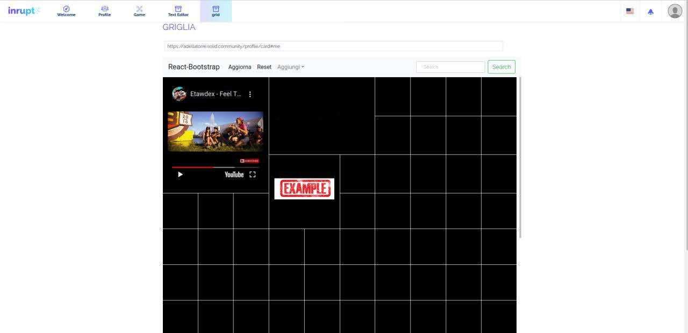

<!-- css -->

<ul>
  <li>
    <a  href="/">Home</a>
  </li>
  <li>
    <a  href="/aboutme">AboutMe</a>
  </li>
  <li>
    <a href="/contatti">Competenze</a>
  </li>
  <li>
    <a  href="/progetti">Progetti</a>
  </li>
  <li>
    <a href="/contatti">Contatti</a>
  </li>
</ul>

---

## echo "**Project Grid**" > ~/.bash_history
---
Data: Gennaio 2020 - Giugno 2020  

Esempio di interfaccia:

### Descrizione:
_Project Grid si opneva come obbiettivo quello di creare una piattaforma open con focus principale la fusione di tutti gli elementi caratterizzanti di internet quali: immagini, siti web, video, testi, link... ed inserendoli all'interno di una griglia._  
Ci sono diversi elementi che rendevano questa piattaforma unica quali:
1. La libera scelta di cosa inserire all'interno dei quadrati permettendo una completa personalizzazione del proprio profilo(o 'personal grid')
2. Il completo possesso dei dati inseriti: le informazioni vengono salvate all'interno di un POD personale di cui l'utente ha completo controllo

**La griglia**: Nell'idea originale, ogni utente aveva 2 griglie principali: la _personal grid_ e la _public grid_.  
  - **Personal Grid**: _La griglia prensente nell'immagine principale rappresentava il profilo dell'utente dove inseriva le sue informazioni private(come se fosse una nuova finestra del browser)._
  - **Public Grid**: _Griglia che rappresentava il profilo pubblico dell'utente che poteva decidere quali parti della griglia rendere visibili all'esterno, in quanto la griglia veniva creata automaticamente al momento dell'accesso lato client prendendo in modo p2p le informazioni contenute nel POD del profilo(in cui ogni oggetto possiede delle acl personalizzate)._

 
L'utilizzo di questa architettura avrebbe permesso di personalizzare il proprio spazio potendo mettere, ad esempio, tutte le homepage dei propri profili social, un insieme di proprie foto, una sola scritta, un elenco dei libri che l'utente ritiene importanti, come pezzi di piattaforme di altri utenti che ne hanno rilasciato l'apposito permesso.  

**La parte social**: La parte sociale di questa piattaforma era rappresentata da 2 punti principali:
1. La condivisione delle informazioni presenti nella personal grid/public grid
2. La possibilità di combinazione/unione delle piattaforme per creare una griglia più grande in comune con più utenti, come se fosse un insieme di due terreni, in cui i possessori avevano gli stessi privilegi sia sulla propria griglia che su quelle degli altri.

 
Il punto 2 è di fondamentale importanza in quanto avrebbe creato uno spazio dinamico, condiviso e democratico in cui gli utenti scambiavano informazioni di qualsiasi tipo. Queste potevano essere utilizzate per creare blog comuni, spazio di storage decentralizzato, utilizzo di più chat in modo contemporaneo e molto altro.  

**Il controllo delle informazioni**: Come detto precedentemente, l'utente ha il pieno controllo delle informazioni. Questo viene fornito attraverso l'obbligo di utilizzo di un POD della piattaforma SolidProject personale in cui le informazioni vengono salvate. Ogni elemento, che sia un link o un documento, ha una propria ACL personale e quindi permette all'utente di decidere in modo autonomo a quali persone condividere quali contenuti.  
Completamente compliant con il GDPR, l'utente potrebbe eliminare il suo profilo in qualsiasi momento essendo sicuro che i suoi dati non vengano più utilizzati da altri, potrebbe accederci in qualsiasi momento e potrebbe fare il porting dei dati senza la necessità di richiederlo a nessuna piattaforma esterna.

### Conoscenze acquisite:
  - Framework React

### Linguaggi di programmazione adottati:
  - Javascript
  - Php

---
