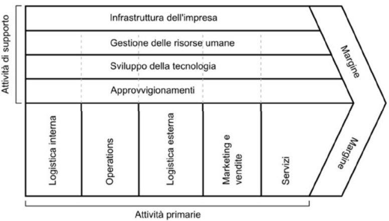
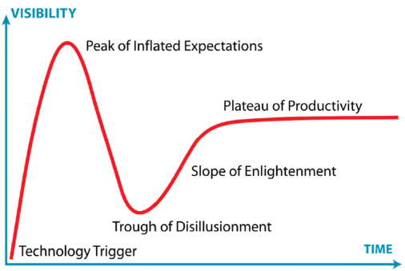
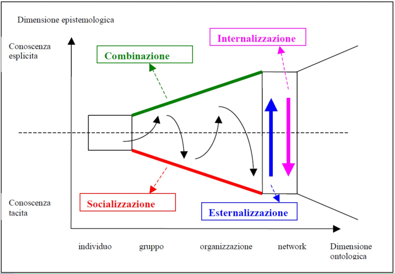
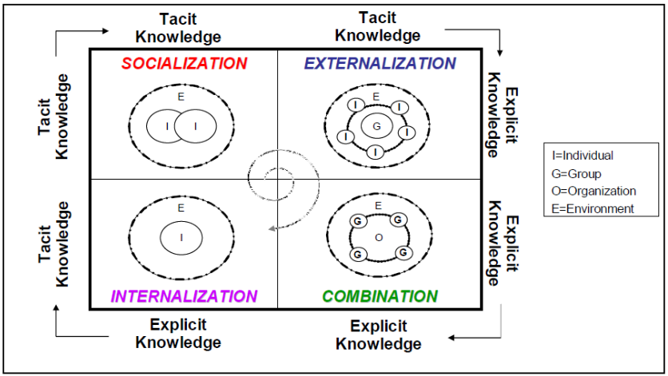
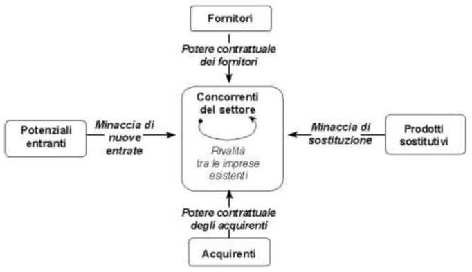
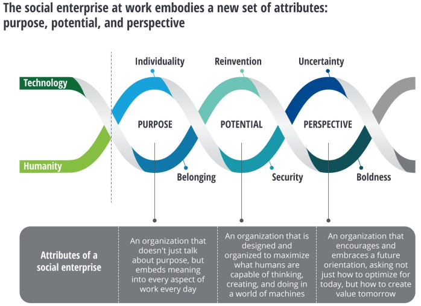
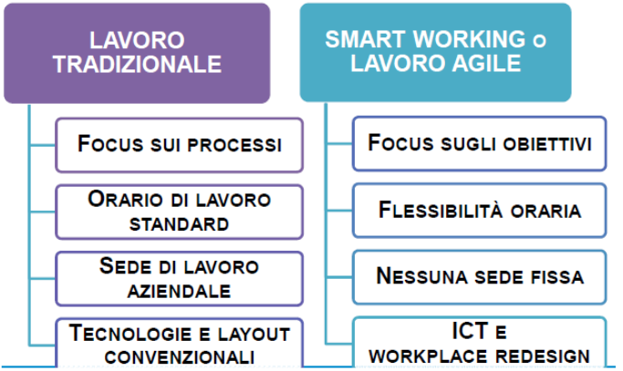
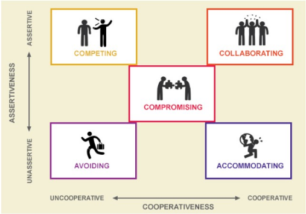



---

# Organizzazione Aziendale
## Indice
0. #### **Assetto Organizzativo**
  - _Struttura organizzativa_
    - Macrostruttura
    - Microstruttura
  - _Sistemi Operativi_
    - Sistema di gestione del personale
    - Sistema di programmazione e di controllo
    - Sistema informativo
  - _Variabili individuali_ (1), _sociali_ (2) e di _contesto_ (3)
    - 1) Competenze, valori, bisogni
    - 2) Gruppi, coesione/conflitto, cultura
    - 3) Ambiente, strategia, tecnologie, dimensioni
1. #### **Modulo - La progettazione Organizzativa**
   - [Definizione Organizzazione](#definizione-organizzazione)
   - Fattori Contingenti
   - Componenti Organizzative
   - Definizione progettazione organizzativa
   - **[Star Model](#star-model)**
     1. _Strategia_
     2. _Struttura_
     3. _Processi_
     4. _Sistemi Premianti_
     5. _Persone_
   - **[Fasi](#fasi-progettazione-organizzativa)**
     1. Attivazione
     2. Definizione Attori
     3. Comunicazione
     4. **[Analisi](#analisi-organizzativa)**
        - Interazione/Osservazione
          1. _Osservazione_
          2. _Intervista_
          3. _Focus Group_
        - Raccolta Dati
          1. _Analisi documentale_
          2. _Misurazione_
          3. _Dati Generali_
          4. _Survey/Indagini_
     5. Progettazione
     6. Change management
     7. Verifica e Valutazione
   - Attori
   - **[Mappatura di un processo](#mappatura-di-un-processo)**
     - Definizione processo
     - Definizione mappatura di un processo
     - Elementi chiave di un processo
       - _Output_
       - _Prestazioni_
       - _Fasi_
       - _Input_
       - _Risorse_
       - _Interdipendenze_
       - _Metodi di gestione_
     - Interdipendenze _[Generica, Sequenziale, Reciproca]_
     - **Fasi**
       1. Individuare i processi aziendali
       2. Individuare il target della mappatura
       3. Raccogliere informazioni sui processi
       4. Costruire i modelli dei processi
          - Analisi della procedura
     - Ambiti e livelli della progettazione organizzativa
   - **[Progettare Microstruttura](#progettare-microstruttura)**
     1. Cosa consiste
     2. Concetti chiave _[Compito, Posizione, Mansione, Ruolo]_
     3. Elementi fondanti
     4. **Specializzazione**
        - Dimensioni _[Verticale, Orizzontale]_
        - Vantaggi
        - RIschi
     5. **Meccanismi di coordinamento**
        - 3 punti
        - Circle
          1. _Adattamento reciproco_
          2. _Supervisione diretta_
          3. _Standardizzazione processi_
          4. _Standardizzazione risultati_
          5. _Standardizzazinoe competenze_
   - **[Progettare Macrostruttura](#progettare-macrostruttura)**
     1. Organigramma
     2. UO
     3. **Dimensione Unità organizzative**
        - Orizzontale _[Span of control, Ampiezza manageriale]_
        - Verticale _[Catena gerarchica]_
     4. **Tipologia Unità organizzative**
        - Organi di linea
        - Organi di staff
        - Unità organizzative permanenti
        - Unità organizzative temporanee
     5. **Criteri di raggruppamento**
        - Economie di scala
        - Economie di specializzazione
        - Interdipendenze dei pèrocessi e flussi di lavoro
     6. **Meccanismi di integrazione tra unità organizzative**
        - Ruoli di collegamento o meccanismo del distacco
        - Manager integratori
        - Team interfunzionali
        - Sistemi di pianificazione e controllo
        - Sistemi informativi aziendali
   - **Strutture organizzative - Idaltipi**
     1. **[Struttura semplice](#struttura-semplice)**
        - Struttura poco articolata
        - Basso livello formalizzazione
        - Criterio di divisione del lavoro
        - Meccanismi di coordinamento
     2. **[Struttura funzionale](#struttura-funzionale)**
        - Unità organizzate al primo livello gerarchico progettate raggruppando unità
        - Vantaggi
        - Svantaggi
        - Meccanismi di coordinamento
     3. **[Struttura divisionale](#struttura-divisionale)**
        - Caratteristiche
        - Divisione _[Prodotto, Mercato, Area geografica]_
        - Vantaggi
        - Svantaggi
     4. **[Struttura a matrice](#struttura-a-matrice)**
        - Caratteristiche
        - Vantaggi
        - Svantaggi
2. #### **Modulo - La componente Tecnologica dell'organizzazione**
   - [Digital Transformation](#digital-transformation)
   - Produzione 4.0
   - Definizione Tecnologia
   - 3 Livelli tecnologia _[Individuale, Funzionale/Dipartimentale, Organizzativo]_
   - **[Woodward](#woodward)**
     - Complessità tecnologica _[Alta, Bassa]_
     - 3 Classi tecnologia produttiva
       1. Tecnologia per unità e piccole serie
       2. Tecnoligia per grandi serie e di massa
       3. Tecnologia a ciclo continuo
   - **[Charles Perrow](#charles-perrow)**
     - Modelli meccanici/organici _[tecnologia routine o meno]_
     - Charles Perrow _[Varietà, Analizzabilità]_
     - Charles Perrow - 4 Tipi di tecnoligie
       1. _Artigianali_
       2. _Routinarie_
       3. _Non routinarie_
       4. _Ingengeristiche_
   - **[Apprendimento organizzativo](#apprendimento-organizzativo)**
     - Tipologie di conoscenza _[Esplicita, Implicita/Tacita]_
     - **Livelli di apprendimento/conoscenza**
       1. Individuale _[Know-what, Know-how, Disposizionale]_
       2. Di Gruppo
       3. Organizzativo _[Capitale: Umano, Sociale, Organzzativo]_
       4. Interorganizzativo
     - **[Spirale conoscenza](#spirale-della-conoscenza)**
       1. _Socializzazione_
       2. _Esternalizzazione_
       3. _Combinazione_
       4. _Interiorizzazione_
     - **Big Data**
       - Vantaggio Competitivo
       - Strategia
       - Modello 5 forze
       - Big Data
       - Big Data \& Vantaggio Competitivo
       - Barriere all\'ingresso
     - **Smart Working**
       - Definizione
       - Elementi base legge istitutiva _[Obbiettivo, Come, Dove, Quanto]_
       - Implementare Smart Working
3. #### **Modulo - La componente Sociale dell'organizzazione**
   1. **[Cultura Organizzativa](#cultura-organizzativa)**
      - Caratteristiche
      - Funzioni
      - Modelli
        1. _Cultura Adattiva_
        2. _Cultura della Missione_
        3. _Cultura di Clan_
        4. _Cultura Butocrativa_
   2. **[Dal lavoro in gruppo ai team individuali](#dal-lavoro-di-gruppo-ai-team-individuali)**
      - Squadra
      - Fasi gruppi di lavoro
        1. _Forming_
        2. _Storming_
        3. _Norming_
        4. _Performing_
      - Effetto Ash
      - Groupthink
        1. _Definizione_
        2. _Sintomi_
        3. _Conseguenze_
      - Team Virtuali
        - Definizione
        - 6 Attributi
   3. **[Conflitto e Negoziazione](#conflitto-e-negoziazione)**
      - Conflitto
      - Fasi del conflitto
        1. Condizioni antecedenti
        2. Conflitto percepito
        3. Conflitto manifesto
        4. Risoluzione/soppressione
        5. Ricadute
      - Tipologie
        1. Conflitti Interpersonali
        2. Conflitti occasionali
        3. Conflitti Strutturali
   4. **[Conflict Mode Instrument](#conflict-mode-instrumenti)**
      - Aspetti generali _[Assertività, Cooperatività]_
      - **TKI**
        1. _Elusione_
        2. _Accomodamento_
        3. _Compromesso_
        4. _Competizione_
        5. _Collaborazione_
   5. **[Leadership](#leadership)**
      - Definizione
      - Capacità di leadership
      - Teorie di leadership _[Teoria X, Teoria Y]_
      - Stili di leadership _[Leader Transazionale, Leader Transformazionale]_
      - Dimensioni della leadership
        1. _Comunicazione_
        2. _Compito_
        3. _Gruppo_
   6. **[Cambiamento Organizzativo](#cambiamento-organizzativo)**
      - Definizione
      - Cambiamento organizzativo
      - Innovazione organizzativa
      - **Modello lewin**
        1. _Unfreezing_
        2. _Mooving_
        3. _Refreezing_
      - Superare le resistenze del cambiamento
4. **[Possibili domande](#possibili-domande)**

# Modulo 1
### Assetto organizzativo:
 
 

- _Struttura organizzativa_
  - Macrostruttura
  - Microstruttura
- _Sistemi Operativi_
  - Sistema di gestione del personale
  - Sistema di programmazione e di controllo
  - Sistema informativo
- _Variabili individuali_ (1), _sociali_ (2) e di _contesto_ (3)
  - 1) Competenze, valori, bisogni
  - 2) Gruppi, coesione/conflitto, cultura
  - 3) Ambiente, strategia, tecnologie, dimensioni

#### Definizione organizzazione
> Le organizzazioni sono _(1)_ entità sociali _(2)_ guidate da obbiettivi, _(3)_ progettate come sistemi di attività deliberatamente strutturati e coordinati che _(4)_ interagiscono con l'ambiente esterno

#### Dimensioni strutturali(o struttura organizzativa, descrivono la struttura)
1. **Macro**: Si vedono nell'organigramma
   - Specializzazione o grado in cui i compiti vengono suddivisi
   - Gerarchia di importanza
2. **Micro**(contenuti e requisiti delle posizioni)
   - _Formalizzazione_: Quantità di documentazione scritta dalla posizione
   - _Centralizzazione/accentramento decisionale_: Chi può prendere decisioni
   - _Complessità dei compiti_
   - _Professionalità_: Requisiti di competenza della posizione

#### Ambiti e livelli di progettazione strutturale
- **MICRO**: Progettazione delle posizioni e definizione dei contenuti(ruoli e mansioni)
- **MACRO**: Progettazione delle unità organizzative

### Fattori contingenti(influenzano la struttura)
1. Dimensione
2. Obbiettivi e strategia
3. Cultura
4. Tecnologia
5. Ambiente

### Componenti organizzative
1. _Vertice strategico_: Guida, strategia, obbiettivi e politiche
2. _Linea intermedia_: Implementazione, coordinamento unità organizzative
3. _Nucleo operativo_: Persone lavoro basilare
4. _Tecno struttura_: Persone individuare problemi, opportunità, sviluppi tecnologici -> Adattarsi ambiente
5. _Staff supporto_: Ordinato svolgimento attività, manutenzione

### Definizione progettazione organizzativa
> Insieme di _azioni_ deliberate definite sulla base di _modelli razionali_, volte a definire la distribuzione di _attività elementari_(task) che devono essere svolte per raggiungere gli _obbiettivi_ prefissati tra _ruoli, unità, macro unità e società_ in modo da massimizzare l'_efficacia, efficienza, flessibilità_ e gestione della _novità_.

### Star Model
_Strategia di come strutturare i processi dei sistemi premianti delle persone_
- **Strategia**: Determina direzione verso cui muoversi attraverso gli obbiettivi, valori e una missione; modifiche di una strategia richiedono adattamenti dell'organizzazione
  - _Efficienza_: Focus primario su input, uso delle risorse, costi
  - _Efficacia_: Focus sugli output, prodotti o servizi, ricavi
- **Struttura**: Determina il posizionamento del potere e dell'autorità nell'organizzazione
  1. _Divisione del lavoro o specializzazione_
  2. _La forma_(numero persone che costituiscono i dip. a ogni livello della struttura)
  3. _Distribuzione del potere_
  4. _Suddivisione in dipartimenti_
- **Processi**: Possono essere verticali o orizzontali e determinano il flusso delle informazioni e delle decisioni lungo la struttura dell'organizzazione
- **Sistemi Premianti**: Allineare gli obbiettivi del dipendente con gli obbiettivi dell'organizzazione; fornisce motivazione/incentivi per il completamento della direzione strategica; deve essere congruente con la struttura e i processi per influenzare la direzione strategica
- **Persone**: Politiche delle risorse umane di reclutamento, selezione, rotazione, formazione e sviluppo

#### Fasi progettazione organizzativa
1. **Attivazione**: Attivata da un insime di _decisioni organizzative_ che possono venire da _livelli diversi_ dell'organizzazione ma che devono essere motivate in relazione di qualche _obiettivo/valore_ per l'organizzazione.  
Questi attori devono avere un potere formale di natura _razionale legale_ per poter originare il processo.
2. **Definizione attori**: Necessario individuare gli attori che saranno operativamente coinvolti nelle attività di rilavazione delle informazioni e di progettazione; investire gli attori di un potere formale di acquisire le informazioni all'interno dell'organizzazione
3. **Comunicazione**: Team di progettazione deve entrare in contatto con l'organizzazione e i suoi attori, è necessario comunicargli la natura, obbiettivi e le modalità dell'azione di progettazione organizzativa
4. **Analisi**: Fase che continua per un arco di tempo prolungato; si avvale di strumenti e tecniche di rilevazione ed è essenziale che il team di progettazione le sappia utilizzare in modo adeguato
5. **Progettazione**: Post racconta informazioni, sulla base degli obbiettivi, si procede a definire e formalizzare delle soluzioni organizzative che possono prendere forme diverse(app informatiche, diagrammi di flusso e proced, organigrammi e job descript) => Queste soluzioni vanno proposte da chi ha sviluppato l'analisi e condivise talvolta con modifiche e adattamenti in un team allargato ai committenti
6. **Change management**: Individuata la soluzione organizzativa si richiede di attivarla e realizzarla nell'organizzazione
7. **Verifica e valutazione**: Un adeguatoinvestimento nella verifica e valutazione aiuterebbe molto ad operare il necessario fine tuning delle soluzioni organizzative

#### Attori della progettazione organizzativa
- Committente
- Analisti
- Progettisti (sottoinsieme specializzato analisti)
- La funzione organizzazione
- Destinatari

#### Analisi organizzativa
> Studio e classificazione delle attività svolte nell'azienda, nell'individuazione dei centri di autorità/potere e di responsabilità e nella definizione dei rapporti e dei collegamenti esistenti fra le varie unità aziendali.
Strumenti utilizzabili:
- **Interazione/Osservazione**
  - _Osservazione_: Una comprensione dell'organizzazion in presa diretta può rivelarsi molto utile per identificare gli eventi imprevisti e quelli apparentemente privi di funzione
  - _Intervista_: Utilizzata per disegnare il profilo ideale di ogni tuolo e raccogliere informazioni relative: alle arrività recentemente svolte dalla persona, le conoscenze professionali e le esperienze necessarie per ricoprire al meglio il ruolo in oggetto => Ricostruire i principali processi organizzativi grazie ai contributi di ogni attore in sequenza
    - ! Le attività realmente svolte molte volte non sono sempre proprie del ruolo oggetto dell'intervista
  - _Focus Group_: Strumenti di raccolta dati molto utilizzati nella ricerca sociale e consistono in sessioni con persone invitate a parlare, discutere e confrontarsi riguardo all'atteggiamento nei confronti di un tema o attraverso domande iterattive
- **Raccolta Dati**
  - _Analisi documentale_: Spesso le organizzazioni possiedono già della documentazione da cui trarre informazioni, è importante collocarla in ordine cronologico e tenere traccia di chi sono gli autori e del loro ruolo
  - _Misurazione_: Ha come oggetto lo svolgimento dei compiti ripetuti e routinari come quelli in sede di plant o in alcuni uffici dedicati alla gesione di pratiche ripetute
    - MTM
    - Analisi carichi di lavoro
  - _Dati Generali_: L'uso dei dati in generale nell'analisi organizzativa è utile per individuare relazioni tra attività svolte e sizing della forza lavoro e determinare, ad esempio, il presidio necessario in funzione degli arrivi dei clienti in una attività di servizio
  - _Survey/Indagini_: Strumenti di raccolta di informazioni, basati generalmente sui questionari che richiedono una definizione precisa degli elementi da conoscere

## Mappatura di un processo
#### Processo
> Insieme di attività tra loro collegate che coinvolgono più aree specialistiche, finalizzate al raggiungimento di uno o più obbiettivi core e uno specifico output che tocca direttamente il cliente interno/esterno

#### Mappatura di un processo
> Ogni attività ha uno specifico Owner e una specifica collocazione sull'asse temporale. Mappare una procedura significa individuare questi owner e formalizzare questa sequenzialità

#### Elmenti chiave di un processo
1. Output
2. Prestazioni
3. Fasi
4. Input
5. Attori e Risorse
6. Interdipendenze
7. Metodi di gestione

#### Interdipendenze
- Generica
- Sequenziale
- Reciproca

#### Fasi mappatura dei processi
1. **Individuare i processi aziendali**: Individuare i processi
   1. _Primari_: Che creano direttamente valore riconosciuto dal cliente esterno le cui performance impattano sul livello di soddisfazione del cliente
   2. _Supporto_: Necessari alla gestione dei processi primari, hanno clienti interni
   - _Catena del valore di Porter_
2. **Individuare il target della mappatura**: Possibile utilizzare un approccio Esaustivo, dei processi chiave, uno basato sull'analisi dei problemi
3. **Raccogliere informazioni sui processi**: Possibile utilizzo di fonti quali:
   - Organigramma aziendale, manuali/mansionari, interviste, analisi dei dati, osservazione passiva
4. **Costruire i modelli dei processi**: Flow chart
   - _Procedure_: Oltre al flow chart, che ci da visivamente l'ideadi come funziona il processo, la mappatura si completa con la procedura, ovvero un documento in cui il processo viene descritto e contiene anche informazioni quali:
     - Lo scopo del processo
     - Il campo di applicazione
     - Il giorno in cui diventa ufficiale
     - La persona che presidia l'interno processo
     - La documentazione allegata

_Catena del valore di Porter_ 
 

#### Analisi della procedura:
La procedura descrive analiticamente il flusso delle attività e può essere divisa in 6 fasi:
1. Manifestazione dell'esigenza
2. Reperimento dei candidati
3. Colloqui di selezione
4. Valutazione co.val.
5. Decisione
6. Inserimento del personale

### Ambiti e livelli della progettazione organizzativa
- _Progettare delle posizioni e definizione dei contenuti, come ruoli e mansioni_(micro) 
  - Livello di specializzazione mansioni individuali
  - Formalizzare compiti che gli individui devono realizzare
  - Individuare i meccanismi di coordinamento necessari o più efficaci tra le persone
  - Intersezione con gestione risorse umane
- _Progettazione delle unità organizzative_(macro)
  - Definizione delle unità organizzative
  - Dimensioni, profilo di competenze, responsabilità e obbiettivi
  - Eventuali sottounità e meccanismi di coordinamento
  - Descritte da organigramma

### Progettare Microstruttura
- **Progettazione delle posizioni(job design)** consiste in:
  1. Definire il contenuto del lavoro e il ruolo degli individui
  2. Formalizzare in modo più o meno marcato il comportamento
  3. Sviluppare competenze e capacità in funzione della posizione
- **Ha 4 concetti chiave**:
  1. _Compito_: Indica una o più attività(_operazioni_) attribuite ad una posizione in modo continuativo(_duty_) o ad una persona in modo non continuativo(_task_)
  2. _Posizione_: Insieme delle attività(mansioni, compiti) e degli obbiettivi/responsabilità assegnati ad una casella organizzativa
  3. _Mansione_(job): Insieme di compiti che viene atribuito ad una posizione individuale
  4. _Ruolo_: insieme delle aspettative di comportamento attese da chi ricopre una posizione in relazione agli obbiettivi
- Ha degli **elementi fondanti**:
  - Il nome della posizione e la sua collocazione organizzativa
  - Lo scopo o mission
  - I compiti
  - Le responsabilità
- Deve essere una sotoria corta, indirizzata sul presente, focalizzata sulle persone e e sempre dinamica, in quanto deve essere adeguata alla situaizone contingente

#### Specializzazione
> Nasce dalla necessità di dividere il lavoro tra più persone o unità organizzative per ottenere un output o risultato con maggiore produttività ed efficienza

- **Dimensioni**:
  - _Verticale_: Separazione tra _progettazione ed esecuzione_ delle attività che porta alla separazione tra _esecuzione e controllo_
  - _Orizzontale_: Ripartizione dei compiti elementari necessari alla realizzazione di un certo output
- **Vantaggi**: Immaginabili
- **Rischi**: Frustrazione, alienazione, riduzione efficienza complessiva dei processi aziendali

#### Meccanismi di coordinamento
1. Specializzazione del lavoro
2. Esigenza di coordinamento
3. Coerenza e risultati dell'insieme delle attività svolte

**Circle**:
1. _Adattamento reciproco_: Si basa su accordi diretti e informali, meccanismo coordinamento _ex-post_, controllo del lavoro e discrezionalità degli operatori
2. _Supervisione diretta_: Presenza formale di un capo che decide cosa fare e controlla il lavoro, meccanismo _ex-post_, integrativo e non sostitutivo dell'adattamento reciproco, limite di span of control(numero persone controllabili)
3. _Standardizzazione processi_: Suddivisione, progettazione a priori del lavoro, meccanismo coordinamento _ex-ante_, applicazione a processi stabili, con bassa incertezza e variabilità
4. _Standardizzazione risultati_: Indicazione del risultato da produrre senza specificare le modelità, _ex-ante_, esecuzione e controllo non necessariamente separati
5. _Standardizzazione competenze_: Svolgimento dei compiti assegnati e interazione sulla base delle competenze possedute, _ex-ante_, formazione come strumento di standardizzazione

### Progettazione Macrostruttura
**Organigramma**: Rappresenta la macrostruttura, visualizzando le unità e le relazioni di dipendenza gerarchica  
**UO**: Sottoinsieme di posizioni/ruoli con insieme di compiti:
  - Atribuibili in modo relativamente stabile
  - Correlati tra loro
  - Sufficientemente autonomi e misurabili

#### Dimensioni Unità Organizzative:
- **Orizzontale**:
  - _Span of control_: Numero totale di persone/posizioni direttamente dipendenti da un capo o supervisore
  - _Ampiezza manageriale_: Numero di mansioni organizzative dipendenti dal supervisore
- **Verticale**:
  - _Catena gerarchica_: Numero di livelli gerarchici presenti

#### Tipologia di unità organizzative:
  - _Organi di linea_: Collocate lungo la linea gerarchica dall'alta direzione agli organi operativi, si occupano dell'attività centrale dell'azienda
  - _Organi di staff_: Supporto agli organi di linea a diversi livelli gerarchichi e garantiscono il regolare funzionamento e la manutenzione dell'organizzazione
  - _Unità organizzative permanenti_: Appartengono all'organizzazione in modo permanente, di solito rappresentate nell'organigramma
  - _Unità organizzative temporanee_: Unità formate rispetto ad obbiettivi specifici con scadenza temporale determinata

#### Criteri di raggruppamento
- Obbiettivi di efficienza e risuzione dei costi -> _Orientato agli input_(Funzione svolta, conoscenze/capacità)
  - _Economie di scala_: Diminuzione costi unitari di produzione per accentramento di un maggior volume di attività in una stessa unità organizzativa
  - _Economie di specializzazione_: Vantaggi specializzazione delle competenze, sviluppo know how, interazione tra esperti
- Obbiettivi di massimizzare efficacia output -> _Orientato agli output_(Prodotto, business unit, cliente, base geografica)
  - _Interdipendeneze dei processi e flussi di lavoro_: Coordinamento sul prodotto, cliente, mercato, area geografica e vantaggi da integrazione e coordinamento di attività in sequenza o in forte interazione reciproca per la realizzazione di un determinato output

#### Meccanismi di integrazione tra unità organizzative
> Meccanismi di integrazione(_collegamento orizzontale_) tra le unità organizzative per recuperare coordinamento e allineamento(_interdipendenze residue_)
- _Ruoli di collegamento o meccanismo del distacco_: Ruolo specificato all'interno di una unità organizzativa dedicato a integrazione con un'altra unità
- _Manager integratori_: Product manager, project manager o account manager, ovvero attività non dedicate ad unità determinate con ruolo più ampio di integrazione e responsabilità sul raggiungimento di obbiettivi specifici
- _Team interfunzionali_: Gruppi costituiti ad hoc da rappresentanti delle diverse unità organizzative che richiedono il coordinamento
- _Sistemi di pianificazione e controllo_: Come obbiettivo hanno la definizione degli output desiderati e azioni per le unità organizzative a partire dai piani generali dell'impresa e verifica della realizzazione; implementazione di standardizzazione di obbiettivi e processi a livello di unità organizzative
- _Sistemi informativi aziendali_: Utilizzo di tecnologia dell'informazione e della comunicazione ai fini dell'integrazione tra unità organizzative

### Strutture Organizzative - Idealtipi
#### Struttura semplice
- _Struttura poco articolata_: Poche unità organizzative essenziali
- Accentramento decisionale nella figura dell'imprenditore
- _Basso livello di formalizzazione_: Assenza di procedure, descrizione delle mansioni
- _Criterio di divisione del lavoro_: Competenza in grado
- _Meccanismi di coordinamento_: Mutuo adattamento, standardizzazione delle competenze

#### Struttura funzionale
- _Unità organizzate al primo livello gerarchico progettate raggruppando unità_: In base ad una funzione comune, attività omogenee per natura e fattori tecnico-economici
- _Vantaggi_: Efficienza
- _Svantaggi_:
  - Mancanza di focus su specifici prodotti, clienti, mercati
  - Lentezza decisionale, diseconomie da mancata integreazione
  - Elevata burocratizzazione
- _Meccanismi di coordinamento_: Standardizzazione obbiettivi di ottimizzazione locale, supervisione all'interno delle funzioni

#### Struttura divisionale (_Binance_)
Assegnare diversi segmenti di mercato a diverse divisioni più o meno autonome e autosufficienti, ognuna contenente tutte le attività e funzioni necessarie per realizzare un certo prodotto
- Raggruppamento basato sugli _output_ dell'organizzazione
- Ogni divisione costituisce una piccola azienda nell'azienda con un proprio _budjet_ e dei propri _obbiettivi_
- Ogni _business unit_ si può gestire in maniera _autonoma_, ne consegue una maggiore _flessibilità_ nel rispondere ai cambiamenti _esterni_
- Maggiore autonomia e _decentramento decisionale_
- Maggiore _vicinanza_ al cliente e _facilità_ di contatto

**Divisione** per:
- _Prodotto_
- _Mercato_
- _Area gografica_

Punti di **forza**:
1. Indicata nel caso di _rapidi cambiamenti_ in un ambiente _instabile_
2. Soddisfa i clienti perchè le _responsabilità_ sul prodotto e i _punti di contatto_ sono chiari
3. Permette alto grado di _coordinamento_ tra le funzioni
4. Le unità si _adattano_ a differenze di prodotto, geografiche e di clientela
5. Preferibile in organizzazioni di grandi dimensioni con molti prodotti
6. _Decentralizza_ il processo decisionale

Punti di **debolezza**:
1. _Elimina_ le economie di scala nelle unità funzionali
2. Scarso _coordinamento_ tra le diverse linee di prodotto
3. Rende difficile l'_integrazione_ e la _standardizzazione_ tra linee diprodotto
4. Elimina l'_approfondimento_ delle competenze e la _specializzazione_ tecnica

#### Struttura a matrice
- **Compresenza** di criteri _funzionali_ e _divisionali_
- Tentativo di conciliare i vantaggi delle diverse strutture organizzative limitandone gli svantaggi
  - **Funzionale**: Aree stabili, economie di scala e specializzazione
  - **Divisionale**: Flessibilità, personalizzazione, adattamento
- Uguale pesi di criteri funzionali e divisionali
- _Rottura del principio di unicità di comando_
- Organizzazioni complesse, compresenza di obbiettivi e criticità
- _Dimensione funzionale_: Accumulo, sviluppo, scambio competenze specialistiche, logica finalizzata all'integrazione interfunzionale
- _Dimensione di progetto_: Realizzazione output specifico, Uso spinto di logica di manager integratori(project-based organization)

**Forza**
- Ambienti molto complessi e incerti
- Mlteplici tipologie di output critici da monitorare
- Scarsità di risorse condivise tra unità e obbiettivi differenti

**Debolezze**
- Rischio di paralisi
- Duplicità del comando genera confusione e conflittualità
- Costi di coordinamento elevati
- Ridondanza e duplicazione delle risorse

---

# Modulo 2
### Digital Transformation
1. Smart Obj aumentano sempre di più
2. Sempre più applicazioni possibili
3. **Quarta rivoluzione industriale**
   1. Potenza vapore per funzionamento stabilimenti produttivi
   2. Introduzione elettricità, prodotti chimici e del petrolio
   3. Utilizzo dell'elettronica e dell'IT per automatizzare la produzione
   4. _Utilizzo di macchine intelligenti, interconnesse e collegate ad internet_
4. Impatto cambiamento tecnologico sul mondo del lavoro
   1. _IOT_
   2. _Intelligenza Artificiale_
   3. _Digitalizzazione_
   4. _Connettività_

Come gestire la digital trasformation?
> La digital transformation _non_ riguarda solo la tecnologia ma è anche attenzione ai cambiamenti organizzativi ed evoluzione di nuove competenze e modalità di lavoro

Grafico sul ciclo di vita delle tecnologie emergenti Gartner
 

Organizzazione nella 4' rivoluzione industriale
- Nuovi business model, nuovi prodotti e servizi, personalizzazione
- Sistemi interconnessi di relazioni orizzontali tra le organizzazioni che sviluppano transazioni, flussi e collegamenti
- Come si gestisce?
  - _Data management_
  - _Tecnologie di produzione 4.0_
  - _Vendita marketing delle tecnologie_

#### Focus **produzione** 4.0
- Sistema integrato per il controllo dei processi manifatturieri
- Digitalizzaizone di tutti i flussi informativi
- Riduzione drastica degli errori e miglioramento dell'efficienza
- Aumento del decentramento organizzativo e della responsabilizzazione degli operai

#### Definizione tecnologia
> Insieme delle competenze, conoscenze, capacità, tecniche, materiali, materiali... che le persone utilizzano per **cambiare e trasformare** le materie prime in prodotti o servizi di valore

#### I 3 livelli della tecnologia
1. _Livello individuale_: La tecnologia corrisponde alle competenze e le risorse tecniche possedute dalle singole persone
2. _Livello funzionale o dipartimentale_: Le procedure e le tecniche sviluppate dai propri gruppi di lavoro allo scopo di svolgere il loro incarico danno vita a una serie di competenze e risorse tecniche che costituiscono la tecnologia
3. _Livello organizzativo_: Il modo in cui l'organizzazione trasforma gli input in output
   - Produzione di massa
   - Produzione di stampo artigianale

### Woodward
#### Come distinguere le diverse tecnologie a livello organizzativo?
- **Complessità tecnologica**: Misura in cui un processo produttivo può essere programmato in modo da poter essere controllato e da diventare prevedibile
  - _Alta complessità tecnologica_: Quando processi di trasformazione possono essere programmati a priori e automatizzati
  - _Bassa complessità tecnologica_: Quando i processi di trasformazione dipendono soprattutto dalle persone e dalle relative competenze e conoscenze, invece che dalle macchine

#### Dieci livelli complessità - 3 Classi tecnologia produttiva
Woodward identifica dieci livelli di complessità tecnologica associati a 3 classi di tecnologia produttiva
- _Tecnoligia per unità e piccole serie_ - **Bassa complessità**
  - Realizzazione di prodotti su misura, di pezzi unici o di piccole quantità di prodotti; processo di trasformazione flessibile; costi gestione alti
- _Tecnologia per grandi serie e di massa_ - **Media complessità**
  -  Realizzazione grandi volumi di prodotti standardizzati; processo di trasformazione standardizzato; risparmio costi produzione e prezzi più bassi
- _Tecnoligia a ciclo continuo_ - **Alta complessità**
  - Fluidità gestionale, Variazioni minime negli output e ci si ferma raramente; i dipendenti affrontano e risolvono problemi; maggiore efficienza tecnologica rispetto alla produzione di massa

#### Modelli meccanici e organici
 

- _Struttura meccanica_: L'impresa adotta una tecnologia di routine, i dipendenti svolgono attività chiaramente definite in base a regole e procedure ben consolidate
- _Struttura organica_: L'impresa impiega una tecnologia che esula dalla routine e deve sviluppare una struttura che consenta ai dipendenti di reagire rapidamente alle eccezioni

#### Charles Perrow
> La differenza fra le attività e le tecnologie di routine e quelle non di routine, ovvero complesse, dipende da due fattori: _Varietà_, _Analizzabilità_

- **Varietà**: Frequenza di eventi inattesi e nuovi nel lavoro
  - Corrisponde al numero di eccezioni in cui una persona si imbatte mentre svolge una attività
- **Analizzabilità**: Se il lavoro può essere scomposto in step ed esistono procedure basate si dati e criteri oggettivi
  - Corrisponde alla misura in cui si possono seguire procedure dondate sui dati, criteri oggettivi e calcolo per risolvere problemi

Tipi di tecnologie secondo perrow:
1. _Artigianali_: Varietà **BASSA**/ Analizzabilità **BASSA**; I compiti richiedono molta formazione ed esperienza
2. _Routinarie_: Varietà **BASSA** / Analizzabilità **ALTA**: Compiti formalizzati e standardizzati
3. _Non routinarie_: Varietà **ALTA** / Analizzabilità **BASSA**: Molto tempo è dedicato all'analisi di problemi e attività
4. _Ingegneristiche_: Varietà **ALTA**/ Analizzabilità **ALTA** ma presenza di un corpo di conoscenze ben sviluppato per risolvere i problemi

#### Apprendimento organizzativo
> Organizzazione che progetta e sviluppa con decisione la propria struttura, cultura, strategia allos copo di favorire e massimizzare il potenziale dell'apprendimento organizzativo(crea organizzazione in grado di rispondere efficacemente ai cambiamenti dell'ambiente)

Tipologie di conoscenza
- _Esplicita_: Conoscenza formale; può essere codificata, trascritta e trasmessa attraverso documenti o istruzioni
- _Implicita/Tacita_: Difficilmente esplicitabile, basata su esperienza personale, regole approssimative, intuizione e giudizi soggettivi

L'apprendimento organizzativo / conoscenza avviene a tutti questi livelli:
1. **Individuale**
   - _Know-what_: Comprende la conoscenza legata al task del soggetto ed è facilmente memorizzabile e trasferibile
   - _Know-how_: Conoscenza basata sull'esperienza che è soggettiva e tacita e richiede interazioni interpersonali per essere condivisa o trasferita
   - _Disposizionale_: Conoscenza personale che include talenti, attitudini e abilità e non può essere condivisa
2. **Di gruppo**
3. **Organizzativo**
   - _Capitale umano_: Fa riferimento alla conoscenza tacita ed esplicita che i dipendenti possiedono, così come la loro capacità di generarla, ed include valori e atteggiamenti, attitudini e know-how
   - _Capitale sociale_: Fa riferimento al valore delle relazioni interne ed esterne all'organizzazione e alla capacità, attraverso queste relazioni, di generare e condividere conoscenza
   - _Capitale organizzativo_: Conoscenza istituzionalizzata ed esperienza codificata che risiede ed è utilizzabile attraverso banche dati, manuali, strutture, sistemi e processi
4. **Interorganizzativo**

#### Spirale della conoscenza
 

- **Socializzazione** [T->T]: Ha lo scopo di trasferire conoscenza Tacita all'interno di relazioni sociali
  - Ci sono individui che socializzando mettono in comune, si trasmettono conoscenza Tacita
  - Si costruisce un orizzonte comune, uno sfondo rispetto al quale posson iniziare a dialogare e costruire qualcosa con gli altri; si creano dei presupposti di conoscenza reciproca, condividendo esperienze
  - E' una fase sociale(e non individuale); si applica a persone che inizialmente non si conoscono
  - Strumenti:
    1. _Dialogo_
    2. _Narrazione_
    3. _Tecnologie_(connessione con persone distanti tra loro)
    4. _Meeting_ e _spazi di incontro_
- **Esternalizzazione** [T->E]: La conoscenza Tacita genera una nuova conoscenza Esplicita
  - Processo essenzialmente basato sulla comunicazione, nel quale la conoscenza tacita diventa esplicita assumendo forma di metafore, similitudini etc..
  - Può basarsi su tecnologie computer-based
- **Combinazione** [E->E]: Processo di evoluzione combinativa da conoscenza esplicita a conoscenza esplicita attraverso la sistematizzazione dei concetti
  - Le nuove tecnologie vengono:
    1. Acquisite e integrate sia dall'interno che dall'esterno dell'organizzazione, trasformandosi ed evolvendo
    2. Comunicate mediante ad esempio incontri o presentazioni
    3. Codificate e formalizzatre incorporandole in modelli, piani, rapporti e documenti
  - _Strumenti_:
    - Comunicazione supportata non solo da tecnologie computer-based ma anche attraverso i network
    - L'impiego creativo delle reti informatiche di comunicazione e dei database su larga scala facilita questa modalità di conversione della conoscenza
- **Interiorizzazione** [E->T]: Processo di elaborazione delle conoscenze Tacite a partire dalla applicazione di conoscenze Esplicite
  - Interiorizzare le conoscenze elaborate significa farle proprie e tradurle in nuove capacità
  - Si tratta di un concetto strettamente collegato a quello di apprendimento attraverso l'azione
  - Interiorizzazione -> _Routinizzazione inconscia_

 

### Big Data
#### Vantaggio competitivo:
> Saper creare un margine superiore a quello dei concorrenti tra prezzo potenziale e costo di produzione con le risorse che si hanno a disposizione attraverso una strategia

Il vantaggio competitivo è determinato dall'insieme dei punti di forza strategici rispetto ai fattori critici di successo strategico

#### Strategia:
> Una strategia è un piano d'azione con obbiettivi volti a perseguire i fattori di successo attraverso i punti di forza

 

#### Big Data:
> Insieme di dati in cui la grandezza è maggiore di quella di un tipico database in grado di catturare, salvare, gestire ed analizzare.
> Nuovo concept di conoscenza aziendale degli oggetti e degli eventi di business (che fa leva sull'attuale varietà dei dati, sull'aumentata velicità e sul crescente volume dei dati stessi) al fine di generare nuove analisi e insights, precedentemente considerate oltre le capacità tecniche e interpretative disponibili e per scoprire infine un nuovo potenziale valore di business

#### Big Data e vantaggio Competitivo: Obbiettivi
1. Attività di marketing basata sui _Big Data_
2. Innovazioni radicali o _design-driven innovation_
3. Innovazioni provenienti dalla comunità o _crowd innovation_

#### Le sfide organizzative / Barriere all'ingresso:
1. Carenza di competenze specifiche _$\Rightarrow$_ Sistematica carenza di risorse umane specializzate in ambito analitico e predittivo
2. Barriere culturali _$\Rightarrow$_ Nuove modalità collaborative
3. Processi e strutture _$\Rightarrow$_ approccio modulare, flessibilità, buttom up
4. Maturità tecnologica _$\Rightarrow$_ Rapida obsolescenza tecnologica

### Smart working
 

Non è vero che più presenzialismo/ore di lavoro corrispondono a un valore risultante maggiore.  
#### Smartworking:
> Approccio innovativo all'organizzazione del lavoro che integra e supera concetti come il telelavoro o il lavoro in mobilità mettendo in discussione tutti i vincoli tradizionali (spazio fisico, orari di lavoro, strumenti di lavoro) alla ricerca di nuovi equilibri fondati su una maggiore libertà e responsabilizzazione dei lavoratori

 

#### Elementi base legge istitutiva:
1. _Obbiettivo_: Incrementare la competività e agevolare la conciliazione dei tempi di vita e lavoro
2. _Come_: Una modalità di esecuzione del rapporto di lavoro subordinato stabilita mediante accordo tra le parti, con il possibile utilizzo di strumenti tecnologici per lo svolgimento dell'attività lavorativa
3. _Dove_: La prestazione lavorativa viene eseguita, in parte all'interno di locali aziendali e in parte all'esterno senza una postazione fissa
4. _Quanto_: Entro i soli limiti di durata massima dell'orario di lavoro giornaliero e settimanale, derivanti dalla legge e dalla contrattazione collettiva

#### Implementare Smart Working:
1. Redazione di una _POLICY_ relativa alla privacy, alla _sicurezza dei dati_ e del _know-how_ aziendale e dell'utilizzo dei devices aziendali + Accordo sindacale
2. Introduzione del lavoro per _obbiettivi_
3. _Riprogettazione_ degli spazi funzionali per la tipologia di lavoro da svolgere
4. Dotazione tecnlogica necessaria per lavorare da remoto
5. Diffusione di una _cultura organizzativa_ fondata su fiducia e responsabilità
6. Formazione per Sw, sicurezza, data management, gestione del tempo

# Modulo 3
### Cultura Organizzativa
#### Caratteristiche
1. La cultura ha radici profonde
2. La cultura è ampia
3. La cultura è stabile

#### Funzioni
1. Identità organizzativa
2. Impegno collettivo
3. Stabilità dle sistema sociale
4. Mezzo per l'attribuzione del significato

#### Modelli cultura organizzativa
1. **Cultura Adattiva**
   - Ha un focus strategico sull'ambiente esterno che si traduce in flessibilità e cambiamento per soddisfare la necessità dei clienti, questa cultura è orientata all'innovazione, creatività e assunzione di rischi. Incoraggia l'organizzazione a sviluppare la capacità di rilevare, intraprendere e tradurre i segnali provenienti dall'ambiente in strategie di comportamento
2. **Cultura della Missione**
   - E' adatta ad un'organizzazione che si trova nella situazione di servire clienti specifici nell'ambiente esterno senza la necessità di cambiamenti rapidi. Si caratterizza per una visione chiara dello scopo dell'organizzazione ed un focus sul raggiungimento degli obbiettivi
3. **Cultura di Clan**: Caratterizzata da un focus interno, sebbene inserita in un ambiente molto flessibile si concentra principalmente sul coinvolgimento e sulla partecipazione dei membri dell'organizzazione
4. **Cultura Burocratica**: Ha un focus interno e un orientamento coerente con un ambiente stabile. Opera in maniera altamente efficiente, con un approccio metodico nelle attività e l'osservanza di politiche e prassi consolidate. Il basso coinvolgimento personale è controbilanciato da un alto livello di coerenza e conformità alle regole.

### Dal lavoro in gruppo a team individuali
#### Squadra:
> Insieme di individui che interagiscono e dipendono gli uni dagli altri per il raggiungimento di un obbiettivo comune

#### Fasi gruppi di lavoro
1. _Forming_
2. _Storming_
3. _Norming_
4. _Performing_

#### Effetto Asch:
> Consiste nella tendenza a cedere alla posizinoe della maggior parte dei membri di un gruppo sebbene questa venga ritenuta scorretta dall'individuo

#### Groupthink:
> Modo fi pensare improntato alla ricerca del consenso a tutti i costi che sopprime la divergenza di opinioni nei gruppi ad alta coesione

Ovvero il bisogno dei membri di raggiungere l'unanimità supera la loro motivazione a valutare realisticamente i diversi corsi d'azione.  
**Sintomi**:
- Illusione di invulnerabilità
- Razionalizzazione
- Moralità scadente
- Stereotopi sugli oppositori
- Pressioni sui dissenzienti
- Auto-censura
- Illusione di unanimità
- Autodifesa mentale

**Conseguenze**:
- Polarizzazione
- Overconfidence
- Traslazione del rischio

#### Team virtuali:
> Gruppo di lavoratori geograficamente o organizzati in modo distante che sono uniti attraverso strumenti per le telecomunicazioni al fine di completare obbiettivi organizzativi.

#### 6 attributi dei team virtuali
1. **Caratteristiche generali**
   - Appartenenza al team definita
   - Interdipendenza tra i membri del team
   - Responsabilità condivisa da parte dei membri del team sugli outcome
   - Relazioni tra i membri del gruppo attraverso o oltre i confini organizzativi
2. **Caratteristiche specifiche**
   - Dispersione geografica dei membri del team
   - Predominanza di computer-mediated comunication piuttosto che face-to-face comunication al fine di svolgere i compiti assegnati

### Conflitto e Negoziazione
#### Conflitto:
> il conflitto è quel processo per cui una parte percepisce che i propri interessi sono ostacolati o influenzati negativamente da un'altra parte

Il conflitto è fisiologico e funzionale all'interno delle organizzazioni e, se opportunamente gestito, può rappresentare un'occasione per stimolare cooperazione e collaborazione in vista del raggiungimento dei fini organizzativi.  

#### Fasi del conflitto:
1. _Condizioni antecedenti_: Latenza (precondizioni di situazione e/o di comportamento)
2. _Conflitto percepito_: Riconoscimento(fase cognitiva)
3. _Conflitto manifesto_: Percezione emozionale(fase affettiva)
4. _Risluzione/soppressione_: Manifestazione aperta(fase comportamentale)
5. _Ricadute_: Conseguenze

#### Tipologie:
- **Conflitti Interpersonali**
  - Valori
  - Atteggiamenti
  - Credenze
  - Bisogni
  - Personalità
  - Percezioni
  - Giudizi
- **Conflitti Occasionali**
  - Grado di interdipendenza
  - Bisogno di consenso
  - Differenze di status
  - Ambiguità nelle responsabilità
- **Conflitti Strutturali**
  - Specializzazione e differenziazione
  - Goal setting
  - Scarsità di risorse
  - Influenza e autorità multiple
  - Regole e procedure

### Conflict Mode Instrument
Aspetti generali di gestione del conflitto:
- **Assertività**: Tentativi di soddisfare i propri interessi
- **Cooperatività**: Tentativi di soddisfare gli interssi della controparte

 

- **Elusione**: L'elusione implica non essere assertivi nè collaborativi. Quando si elude il problema, l'individuo non persegue immediatamente i propri interessi nè quelli dell0altro. Piuttosto, evita il conflitto. L'elusione può assumere la forma di ignorare diplomaticamentre un problema, posticiparlo fino a momenti più opportuni o semplicemente ritirarsi da una situazione minacciosa.
- **Accomodamento**: Un comportamento accomodante non è affermativo ma è collaborativo; è l'opposto della competizione. Quando adotta un comportamento accomodante, l'individuo tralascia i propri interessi per soddisfare quelloi altrui. Questa modalità imiplica un aspetto di autosacrificio. L'accomodamento può assumere la forma di generosità o altruiscmo, di obbedienza alle richieste altrui anche quando non si è d'accordo, oppure l'arrendersi al punto di vista dell'altro.
- **Compromesso**: Il compromesso rappresenta una via di mezzo tra l'assertività e la collaborazione. Quando si cerca di giungere a un compromesso, l'obbiettivo è quello di trovare un espediente, una soluzione reciprocamente accettabile che soddisfi parzialmente i bisogni fi entrambe le parti. La ricerca di un compromesso rappresenta una via di mezzo tra la competizione e l'accomodamento, nel senso che si rinuncia un pò di più rispetto a quando si compete, ma meno rispetto a quando si adotta un comportamento accomodante. Parimenti, il problema viene affrontato in modo più diretto rispetto all'elusione, ma non si arriva ad approfondirlo come con la collaborazione. Il compromesso può significare trovare un accordo a metà strada, fare delle concessioni reciproche oppuire cercare una soluzione che rappresenti una via di mezzo.
- **Competizione**: La competizione è una modalità assertiva e poco collaborativa, orientata all'ottenimento del potere. In un ambito di competizione, l'individuo persegue i propri interessi a spese di un altro, usando qualsiasi forma di potere apparentemente necessaria per ottener ciò che desidera. Lo spirito di competizione può implicare la difesa dei propri diritti, la difesa di una posizione che si ritiene corretta o semplicemente il desiderio di vittoria.
- **Collaborazione**: La collaborazione ha un carattere sia assertivo che collaborativo. In un contesto di collaborazione, l'individuo cerca di cooperare con l'altro per trovare una soluzione che possa soddisfare i bisogni di entrambe le parti. Implica l'approdonfimento del probloema al fine di identificare le questioni sottostanti percepite dai due individui e trovare un'alternativa in grado di soddisfare i bisogni di entrambi. La collaborazione tra due individui può assumere la forma di esplorazione del disaccordo in un tentativo di imparare l'uno dall'altro, di risoluzione di una condizione specifica altrimenti suscettibile di causare una competizione per le risorse oppure di confronto e ricerca di una soluzione creativa di un proboema interpersonale.

### Leadership
#### Leadership:
> Processo svolto ad influenzare le attività di un individuo o di un gruppo orientandole verso il raggiungimento di un obbiettivo organizzativo

**Capacità di leadership**: Si fonda sull'autorevolezza e non sul ruolo gerarchico ricoperto.  
#### Teorie di Leadership
- **Teoria X**(stile di gestione autoritario): Alle persone non piace lavorare e cercano di evirarlo appena si presenta l'occasione, per questo motivo devono essere forzate a lavorare per raggiungere gli obbiettivi organizztivi minacciando punizioni; le persone vogliono essere dirette, vogliono evitare responsabilità, non sono ambiziose e vogliono prima di tutto sicurezza
- **Teoria Y**(stile di gestione partecipativo): Sforzarsi per raggiungere gli obbiettivi nel lavoro è naturale, le persone si auto-gestiscono ed auto-dirigono per raggiungere gli obbiettivi organizzativi senza necessità di controllo esterno o minaccia di punizioni, queste accetano e cercano più responsabilità. L'impegno di raggiungere gli obbiettivi è in funzione dei benefici connessi con il loro conseguimento. Le capacità di utilizzare un elevato grado di fantasia, impegno e creatività nel risolvere i problemi organizzativi è ampiamente presente nei lavoratori e nelle aziende il potenziale intellettuale delle persone è usato solo parzialmente.

#### Stili di leadership:
- **Leader transazionale**: i leader e i collaboratori sono agenti di negoziazione, la motivazione del collaboratore è legata al proprio interesse, lo stile del leader è dunque legato alle seguenti abilità: Utilizzare ricompense contingenti, Gestire per eccezioni, Adottare uno stile di delega ampia.
- **Leader Transformazionale**: I leader esercitano influenza nella misura in cui aumentano il coinvolgimento, la fiducia e l'autostima dei follower facendo appello a valori ed ideali attraverso quattro processi:
  1. _Utilizzo del carisma_
  2. _Creare ispirazione_
  3. _Considerare le persone individualmente_
  4. _Stimolare intellettualmente_

#### Dimensioni della leadership:
- **Comunicazione**:
  1. Dare una visione chiara degli obbiettivi dell'azienda
  2. Comunicare al collaboratore le aspettative dell'azienda
  3. Dare senso al lavoro del collaboratore; spiegare a cosa serve quello che gli si chiede
  4. Ascoltare i collaboratori, coinvolgendoli e responsabilizandoli
  5. Portare avanti le idee valide del collaboratore, valorizzandole
  6. Comunicare sistematicamente la valutazione del lavoro svolto
- **Compito**:
  1. Considerare il collaboratore innanzitutto come una persona e mai come un semplice strumento
  2. Rispettare il ruolo e valorizzare la professionalità del collaboratore
  3. Responsabilizzare i collaboratori
  4. Creare il giusto equilibrio tra la delega e il controllo
  5. Distinguere sempre tra compito e relazione
  6. Rispettare i criteri di equità
- **Gruppo**:
  1. Creare spirito di appartenenza all'azienda
  2. Creare spirito di gruppo
  3. Dare sostegno e fiducia
  4. Supportare il collaboratore asicurando mezzi e informazionio adeguate per svolgere il proprio lavoro
  5. Mettere a disposizione le proprie competenze
  6. Rispettare le regole del giorno e mantenere gli impegni

### Cambiamento organizzativo
> Processo attraverso il quale le organizzazioni compiono un cambiamento da una condizione presente a una futura per accrescere la loro efficacia. Lo scopo è quello di trovare nuovi modi per utilizzare le risorse e le competenze allo scopo di aumentare la capacità dell'organizzazione di creare valore.

- _Cambiamento organizzativo_: Adozione di un nuovo concetto o comportamento
- _Innovazione organizzativa_: Adozione di un concetto o un comportamento nuovo per il settore, mercato o ambiente di riferimento

#### Modello Lewin
Teoria del cambiamento organizzativo secondo cui due serie di forze sempre in opposizione all'interno di una organizzazione fanno si che un'organizzazione resista al cambiamento e contemporaneamente la spinge verso il cambiamento stesso. Quando le forze sono perfettamente bilanciate, l'organizzazione è inuno stato di inerzi e non cambia. Per ottenere il cambiamento organizzativo, i manager devono trovare il modo di accrescere le spinte al cambiamento, ridurre la resistenza al cambiamento oppure operare entrambe allo stesso momento.
1. **Unfreezing**: Scongelare l'organizzazione dal suo stato attuale
   - Conspevolezza della necessità di cambiare
   - Creazione delle condizioni per il cambiamento
   - Rompere gli schemi di riferimento che includono convinzioni, atteggiamenti e comportamenti
   - Creare una crisi che aiuti a preparare le persone al cambiamento, creando la motivazione al cambiamento
   - Implica momenti di crisi nelle menti delle persone
   - Le persone sono indotte a realizzare che non si può andare avanti ulteriormente con i vecchi metodi
2. **Mooving**: Attuare il cambiamento desiderato
   - Valutazione delle alternative scelte
   - Il processo in cui le persone tentano di superare l'incertezza, ricercando nuovi modi di lavorare
   - Si stabiliscono nuove convinzioni e comportamenti
   - Il management di linea dovrebbe fornire l'indirizzo
   - Sperimentazione
   - Le persone cominciano a capire che i cambiamenti potranno portare dei benefici a loro e all'organizzazione
3. **Refreezing**: Ricongelare l'organizzazione nel suo nuovo stato desiderato
   - Stabilizzazione della nuova soluzione
   - Si giunge al niuovop modo di lavorare
   - Si celebra la 'fine' del vecchio sistema
   - Non si torna indietro
   - Questo stadio incorpora i vari processi e zioni che istituzionalizzavano nuove convinzioni ed atteggiamenti che emergono dal processo del cambiamento

#### Superare le resistenze del cambiamento
1. Sostegno continuativo e convinto da parte del vertice aziendale
2. Favorire la partecipazione estesa fin dalle prime fasi del cambiamento, in modo da farlo diventare una responsabilità e un compito condiviso
3. Allineare il cambiamento con le necessità e gli obbiettivi degli utenti, sia interni che esterni
4. Comunicare, informando le persone sulle necessità e ragioni del cambiamento e formare le persone in modo da renderle capaci di affrontare il cambiamento
5. Creare un ambiente che fornisca sicurezza psicologica, ovvero la possibilità di esprimere la propria opinione, di sperimentare, assumersi dei rischi e anche di sbagliare

---

#### Possibili domande
2
struttura organizzativa di airoldi
caratteristiche organizazione
macro e micro organizazione

3
star model
fasi progettazione organizzativa

4
analisi organizzativa
    intervista
MTM
elementi chiave del processo
catena del valore di porter

5
dice che sui flowchart siamo abbastanza preparati

6
livelli progettazione organizzativa
specializzazione del lavoro
adattamento reciproco vs supervisione diretta
standardizzazione risultati vs standardizzazione processsi

7
descrivere le carattersitiche delle UO
dimensione verticale vs orizzontale
modello di daft

8
idealtipi strutture organizzative
ibrida e matrice

9
funzionale e matrice

10
occhio alle 4 ere industriali come orizzonte temporale, focus e carattersitiche
sapere bene la 4a rivoluzione industriale

- che cos è la tecnologia? parla dei 3 livelli della tecnologia

- distunguere le diverse tecnologie secondo la teoria di woodward (caratteristiche distintive e associare il grado di complessità, no quadro generale)

- modelli meccanici e organici

- teoria di perrow

- apprendimento organizzativo

- tipologie di conoscenza

- spirale conoscenza (storia del pane)

- big data

- 5 forze di porter (fai anche degli esempi)

- barriere all'ingresso (burocratiche, tecnologiche, economiche...)

- strategie competitive

- smart working (3 rischi e 3 opportunita)

- 4 modelli cultura organizzativa

- effetto asch & groupthink

- 6 attributi

- thomas kilman TKI

- stili di leadership: teorie douglas e mcgregor + Bass

- modello di lewin sul cambiamento

