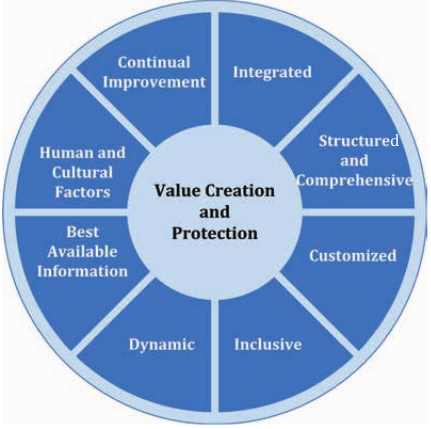



---

# Analisi e gestione del rischio

<!-- TOC -->
- [Analisi e gestione del rischio](#analisi-e-gestione-del-rischio)
- [**ISO 31000**](#iso-31000)
  - Definizione Rischio
    1. "_effetto_ incertezza _obbiettivi_"
    2. _Entità di rischio_: $R=f(P,I)$
    3. "Eventualità _minaccia_(+_vulnerabilità_) $\rightarrow$ _Danno_ $\Rightarrow$ _Impatto_"
  - [Definizioni](#definizionia-namedefinizionia)
    - Sorgente di rischio
    - Evento
    - Minaccia
    - vulnerabilità
    - Danno
    - Impatto
    - Risk Governance
    - **Risk Management**
  - [**Principi**(_Creazione di valore e Protezione_)](#principi)
    - _Value Creation ad Protection_
    1. _Integrato_
    2. _Strutturato e Completo_
       - approccio-consistenti-comparabili
    3. _Personalizzato_
       - norma-generica-contesto-organizzativo-aziendale
    4. _Inclusivo_
       - appropriato-tempestivo / consapevolezza
    5. _Dinamico_
       - fotografia-istantanea / appropriato
    6. _Migliori Informazioni Disponibili_
       input-storico/attuale / aspettativa / tempestive-chiare-disponibili
    7. _Fattori Umani e Culturali_
    8. _Miglioramento Continuo_
  - [**Risk Management Framework**](#risk-management-framework)
    - [Generale](#generale)
      - integrazione $\rightarrow$ attività-funzioni / efficacia **$\rightarrow$** integrazione-governance-decision-making / supporto **$\rightarrow$** stakeholder-top-management / scaletta-inizialmente
    - _Leadership and Commitment_(impegno)
      - controllare-fasi / approccio(policy)
    1. _Integrazione_
       - struttura-organizzativa-contesto-operativo **$\Rightarrow$** scopi,obbiettivi,complessità
       - Frase impos. / processo $\rightarrow$ dinamico-iterativo
    2. _Design_
       - contesto-I/E / TM-OC-dimostrare/articolare-continuo-impegno **$\rightarrow$** policy-dichiarazione-forma **+** obbiettivi
    3. _Implementazione_
       - piano(tempi-risorse) **/** 5W-modificando-decision-making
       - frase "implementato successo" **+** coinvolgimento/consapevolezza / incertezza-decisino-making
    4. _Valutazione_
       - analisi-periodica-funz / dove-migliorie **$\rightarrow$** raggiungimento-obbiettivi
    5. _Miglioramento_
  - [**Processo**](#processo)
    - [Generale](#generale)
    - [Approfondito](#approfondito)
    1. [Scopo, Contesto, Criteri](#scopo-contesto-criteri)
       - personalizzare-consentendo **$\rightarrow$** valutazione-appropriato-trattamento / aiutano: definizione **$\rightarrow$** ambito-processo **+** comprensione **$\rightarrow$** contesto-I/E
    2. [Risk Assessment(_valutazione del rischio_)](#risk-assessment)
       1. _Risk Identification_
          - palla **$\rightarrow$** preventivo-ragg-obb
       2. _Risk Analysis_
          - eva / può-essere-eff-complessità-scopi-inform-affidabilità
       3. _Risk Evaluation_
          - supporto-decisioni / comparando: risk-analysis **$\rightarrow$** criteri-rischio-ulteriori-azioni / azioni? / contando-contesto-attuale+prevedendo-conseguenze
    3. [Risk Treatment](#risk-treatment)
       - selezionare-implementare-opzioni-rispondere / no-eclusive-appropriate
    - [Comunicazione e consultazione](#comunicazione-e-consultazione)
      - assistere-stakeholder
    - [Monitoraggio e Riesame](#monitoring-and-review)
      - qualità-efficacia **$\rightarrow$** progettazione-imiplementazione-risultati-ottenuti
    - [Registrazione e Reportistica](#recording-reporting)
    - [Processo TSAURIUS](#processo-tsaurius)
- [**ISO 27000**](#iso-27000)
  - [Definizioni(infinite)](#definizioniinfinite)definizioni-secondarie
    - Contesto **Interno**
    - Contesto **Esterno**
    - Information Security
    - RID **aka** CIA
    - _Governance_ of Information Security
    - Information Security _Continuity_
    - ISMS _Professional_
    - Risk **Assassment**
    - Risk **Analysis**
    - Risk **Acceptance**
    - Rischio _Parziale_
    - Rischio _Aggregato_
    - Rischio _Potenziale_
    - Rischio _Residuo_
    - Rischi _Puri_
    - Rischi _Speculativi_
    - [**Definizioni-secondarie**](#definizioni-secondarie)
      * "sono propenso alla tolleranza rispetto ai limiti massimi effettivi"
      - _risk tolerance_(tolleranza)
      - _risk profile_(effettivo)
      - _risk capacity_(massimo)
      - _risk limits_(limiti)
    - Risk Tolerance & Risk Appetite
    - **Misurazione**
      - _Qualitativa_
      - _Quantitativa_
  - [ISMS(_Information Security Management System_)](#isms)
    - policy, procedure e linee guida / risorse **$\rightarrow$** attività / collettivamente (`information assets`)
    - basato.risk-assessment-livelli-accettazione-rischio / isis-decisione: integrata,scalata,aggiornata
  - [27000 Family](#27000-family)
- [ISO 27001](#iso-27001)
- [ISO 27002](#iso-27002)
- [**ISO 27005**](#iso-27005)
  - [Vulnerabilità](#vulnerabilità)
    * HW/SW/Net/Personale/Siti-Edifici/Organizzazione
  - [Minacce](#minacce)
    * Azioni non autoriz./Azioni involontarie/Accidentali/
    * Ambientali/Fisiche/Disturbi Elettr./Guasti tecnici/
    * Compromissione informazioni/Compromissione funz.
  - [The company's assets](#the-companys-assets)
    * Materiali/Immateriali/Personale/Other/Correlazione
- [**Casi di studio**](#casi-di-studio)
  - [Tesoretto](#tesoretto)
  - [Passaggio a Livello](#passaggio-a-livello)
- [Cloud Computing](#cloud-computing)
- [IOT](#iot)

<!-- /TOC -->

---

# ISO 31000

E' una _linea guida_ e **non** una _norma di requisiti_: da delle indicazioni alle aziende su come devono adottare il risk management. 
Il rilascio del 2018 si allinea alle altre norme riferite ai sistemi di gestione che seguono una **struttura di alto livello**, incoraggiando:
  - Revisione dei principi di risk management, criterio chiave per il successo
  - Evidenziazione della leadership da parte del top management e l'integrazione del risk management, partendo dalla governance dell'organizzazione
  - Enfatizzazione sulla natura iterativa del risk management
  - Razionalizzazione del contenuto con maggiore attenzione al sostegno di un modello di sistemi aperti per adattarsi a più bisogni e contesti
  - Adozione di un processo _continuo, graduale e proattivo_
  - Il coinvolgimento della _corporate strategy_
  - _Integrazione dei principi_ di Risk Management nella cultura dell'organizzazione

Gestire il rischio(_managing risk_) è un processo iterativo che assite le organizzazioni nelle loro scelte strategiche aiutandole a raggiungere i loro obbiettivi prendendo decisioni responsabili e informate.
  1. **Scopo**: Questo documento rilascia delle linee guida per gestire il rischio da parte delle organizzazioni e fornisce un approccio per qualsiasi tipo di rischio per aziende di qualsiasi settore; questo documento pouò essere applicato a tutti i livelli e un tutte le attività, incluse quelle di decision-making.
  2. Non contiene al suo interno normative

**_La informazione segreta dell'azienda DEVE essere tuttelata tramite misure di sicurezza e quindi viene tutelata anche dalla normativa, quindi una tutela legale automatica. Se non la proteggo non posso avvalermi dei benefici legali che ne derivano._**

## Definizioni
**Rischio**: definito come "_effetto dell'incertezza sugli obbiettivi_"
  - **Effetto**, riguarda ciò diverso da quanto atteso $\Rightarrow$ _positivo/negativo/entrambi_ $\Rightarrow$ può creare _Minacce/Opportunità_
  - **Obbiettivi**, possono avere: _livelli/categorie/aspetti_ **differenti**
  - **Rischio**, espresso generalmente come: _fonti di rischio/eventi parziali/loro conseguenze/probabilità_

**Entità di rischio**: $R=f(P,I)$, dove:
  - **f**: _Funzione che abbiamo scelto per combinare i parametri_
  - **P**: _Probabilità o frequenza dell'incidente in considerazione_
  - **I**: _Magnitudo del danno_

**3^ Interpretazione**:
  - _"Il rischio è l'eventualità che una **Minaccia**, sfruttando una o più **Vulnerabilità**, possa trasformarsi realmente in un **Danno**, comportando così un determinato **Impatto**"_.

**Sorgente di richio**: _Elemento che da solo, o in combinazione ha il potenziale di dare origine ad un rischio_ 
**Evento**: _Occorrenza che cambia un insieme di circostanze_
  - Un evento può avere una o **più occorrenze** e **diverse cause**
  - Un evento può consistere in qualcosa che **non è accaduto**
  - Un evento può essere riferito come **incident/accident**(_incidentale/accidentale?_)

**Minaccia**: _La minaccia viene definita come un **evento** di natura dolosa o accidentale che, sfruttando una **vulnerabilità** del sistema, potrebbe provocare un **danno**; Le minacce possono avere effetto quindi solo in presenza di vulnerabilità_ 
**Vulnerabilità**: _Rappresenta una **debolezza intrinseca** o dovuta a condizioni di esercizio o assenza di controlli, che può essere sfruttata da una **minaccia** per arrecare un **danno**_ 
**Danno**: _Il danno è la conseguenza(spesso identificata da una perdita RID/CIA) del **verificarsi** di un rischio o dell'**attuarsi** di una minaccia; a volte viene distinto in **tangible** o **intangibile**_ 
**Impatto**(sinonimo spesso di danno): _Misura o entità del danno; Effetto sull'azienda del verificarsi di una minaccia_ 
**Stakeholder**: _Persone o organizzazioni che possono influenzare, essere influenzate o percepire di esserlo da attività o decisioni_ 
**Risk Governance**: _Non c'è nella 31000 ma utilizza i termini: Principi, Framework, Processo_ 
**Risk Management**: _E' un processo composto da fasi e attività coordinate tra loro per gestire e controllare un organizzazione in riferimento al rischio_ 

## Principi(_Creazione di valore e Protezione_)

  - **Integrato**: _Il risk management deve essere parte di tutte le attività organizzative_
  - **Strutturato e Completo**: _Un **approccio** strutturato e completo del risk management contribuisce a creare **risultati** consistenti e comparabili_
  - **Personalizzato**: _"norma generica" in quanto il Risk Management Framework e i processi sono creati e proporzionati ad un contesto organizzativo aziendale, sia interno che esterno, in relazione agli obbiettivi_
  - **Inclusivo**: _Appropriato e tempestivo coinvolgimento degli stakeholders aiuta la conoscenza, la visione e la percezione da tenere in considerazione. Questo risoltato migliora la **consapevolezza** e la gestione **consapevole** del rischio_
  - **Dinamico**: _"fotografia istantanea", il rischio può venire da qualsiasi contesto in qualsiasi momento, risk management anticipa, rileva, riconosce e risponde a questi cambiamenti in un modo **appropriato** e tempestivo_
  - **Migliori Informazioni dispobili**: _Input storico o attuale delle informazioni insieme a quelle possbibili future. Risk Management prende in considerazione qualsiasi informazione o **aspettativa**; Le informazioni devono essere tempestive, chiare e disponibili agli stakeholder rilevanti_
  - **Fattori Umani e Culturali**
  - **Miglioramento Continuo**: _Processo, non prodotto_

## Risk Management Framework
**framework**: _'struttura/contesto/architettura di supporto'_

#### Generale
L'obbiettivo del **_"Risk Management Framework"_** è di assistere l'organizzazione nell'_integrazione_ del risk management nelle _attività e funzioni_ fondamentali dell'organizzazione. La sua **efficacia** dipende dalla sua _integrazione_ nella _governance_ dell'organizzazione, comprensiva di _decision-making_. Questo richiede **supporto** degli _stakeholder_, in particolare del _top management_.  
L'organizzazione dovrebbe inizialmente:
  1. _Valutare i processi e le pratiche esistenti di risk management_
  2. _Valutare ogni lacuna(gap) e inserirlo all'interno del framework_
  3. _I diversi componenti dal framework dovrebbero funzionare insieme e essere adattati alle necessità dell'organizzazione_

E' una infrastruttura basata sul **PDCA**(_plan-do-check-act_).
  1. Integrazione
  2. Progettazione
  3. Implementazione
  4. Valutazione
  5. Miglioramento

#### Leadership and Commitment(_impegno_)
Il top management e gli organi di controllo, dove applicabile, dovrebbero controllare che il risk management sia **integrato** in tutte le attivitò organizionali e dovrebbero dimostrare leadership e impegno con:
  - Implementando tutti i componenti del framework
  - Creazione/Emissione di una policy che stabilisce l'**approccio** per gestire il rischio(risk management approach)
  - Assegnazione delle autorità, responsabilità e accountability agli appropriati livelli dell'organizzazione

> L'alta direzione è responsabile della gestione del rischio, mentre gli organi di supervisione sono responsabili della supervisione della gestione del rischio.

#### Integrazione
Per **integrare** il risk management bisogna conoscere la _struttura organizzativa_ e il _contesto operativo_ aziendale $\Rightarrow$ dipendente dagli _scopi, obbiettivi e complessità_. 
Tutti nell'azienda devono avere la responsabilità del rischio 
>La struttura manageriale traduce la _governance directions_ nella strategia associata agli _obbiettivi_ richiesti per **assolvere** i livelli di _persistenza_ delle performance e long-term _viability_. Determinazione della responsabilità della gestione del rischio e dei ruoli di supervisione all'interno dell'organizzazione sono parte integrante della governance dell'organizzazine.

L'integrazione del rischio è un **processo** _dinamico_ e _iterativo_.

#### Design
Quando si progetta il framework per la gestione del rischio, l'organizzazione dovrebbe esaminare il _contesto interno ed esterno_.  
`Spiegazione del constesto interno/esterno` 
**Top management** e gli **organismi di controllo**, ove possibile, dovrebbero **dimostrare** e **articolare** il loro _continuo impegno_ nei confronti del risk management _attraverso la policy_, una dichiarazione o qualsiasi altra forma che chiarisca i loro obbiettivi nella persecuzione spietata del rischio.  
`Spiegazione di cosa potrebbe esserci dentro questa policy: obbiettivi date, relazione stakeholder, responsabilità, misure di reporting...` 
Tutto questo andrebbe comunicato all'organizzazione stessa e agli steakholder nel modo appropriato.
  - Assegnazione dei ruoli, autorità e responsabilità e `accountabilities`(_responsabilità_)
  - Allocazione delle risorse
  - Stabilire metodi di comunicazione e consultazione

#### Implementazione
L'organizzazione dovrebbe implementare il framework di risk management facendo:
  - Sviluppando un proprio piano includendo i propri _tempi e risorse_
  - Sviluppando le 5W
  - Modificando il processo di decision-making ove necessario

Avere **implementato con successo** il framework richiede il _coinvolgimento e la consapevolezza degli stakeholders_.
Questo permette alle organizzazioni di affrontare esplicitamente l'_incertezza nel decision-making_, prendendo in considerazione anche le nuove _incertezze_ che verranno a crearsi.

#### Valutazione
Per verificare l'efficacia del framework, l'organizzazione dovrebbe:
  - Effettuare periodicamente una analisi del suo funzionamento
  - Dove potrebbe essere migliorato e come il suo utilizzo migliora il raggiungimento degli obbiettivi

#### Miglioramento
L'organizzazione dovrebbe continuamente **monitorare** e **adattare** il risk management framework ai **cambiamenti** sia interni che esterni all'interno di un processo **iterativo**.

## Processo

#### Generale
  1. **Scopo, Contesto, Criteri**
  2. **Risk Assessment**
     1. _Identificazione_
     2. _Analisi_
     3. _Valutazione_
  3. **Trattamento dei rischi**
  - **Monitoraggio e Revisione**
  - **Registrazione e Reporting**
  - **Comunicazione e Consultazione**
    - Steakeolder, Attori interni/esterni

#### Approfondito
1. **[Scopo, Contesto, Criteri](#scopo-contesto-criteri) (_Scope, Context, Criteria_)**
   - _Campo di applicazione_
   - _Contesto interno/esterno_
   - _Criteri di gestione del rischio_
     - **R=f(P,I)**:
     - Definizione metriche _Probabilità_
     - Definizione metriche _Impatto,Danno,Conseguenze_
     - Definizione metriche _Rischi parziali_ e _Rischi Aggregati_
       - **Matrice di valutazione**(quali/quanti-tativo)
     - **Criteri di accettazione**
       - _Rischio residuo accettabile $RR_{AC}$_
2. **[Valutazione dei rischi](#risk-assessment)** _(Risk Assessment)_
   1. _Identificazione_
      - Minacce
      - Vulnerabilità
   2. _Analisi_
      - **Bow tie Analysis**: _cause_ $\rightarrow$ _evento_ $\rightarrow$ _impatto_
      - Valutazione dell'_impatto+vulnerabilità_ $\rightarrow$ **Rischio Potenziale**
   3. _Valutazione_
      - [Rischi Parziali](#rischi-parziali)
      - Calcolo Rischi Parziali
      - Creazione tabella rischi parziali con priorità di intervento
      - [Calcolo Rischio Aggregato](#rischio-aggregato)
3. **[Trattamento dei rischi](#risk-treatment)**_(Risk Treatment)_
   1. <a href="#opzioni-trattamento">_Opzioni per il trattamento dei rischi_</a>
      - _`Modificare / Accettare / Evitare / Condividere`_
   2. _Misure e controlli da implementare_
      - Misure Preventive+Mitigazione
   3. _Misure e controlli esistenti_
   4. _Calcolo rischi residui: R=1/C_
      - [Rischi Residui Parziali](#rischio-parziale)
      - Rischio Gestito
      - Rischio Aggregato
   5. _Preparazione piano di trattamento dei rischi_
      - _Creazione tabella: Contromisure, Priorità, Implementazione, Risorse, Incaricato, Stato_
4. **Accettazione Rischi Residui**
5. **Implementazione delle misure e dei controlli**
- **[Monitoraggio e Riesame](#monitoring-and-review)**
- **Comunicazione e Consultazione**
  - _Steakeolder, Attori interni/esterni_

#### Scopo, Contesto, Criteri[!]
_Lo scopo di questo modulo è di **personalizzare** il processo di risk management consentendo un'efficace risk assessment(valutazione del rischio) e **un appropriato** risk treatment(trattamento del rischio)._ 
Scopo, Contesto, Criteri **aiutano** la definizione dell'_ambito del processo_ e la comprensione del _contesto_ interno/esterno.  
- _Campo di applicazione_
- _Contesto interno/esterno_
- _Criteri di gestione del rischio_
  - Definizione metriche _Probabilità_
  - Definizione metriche _Impatto,Danno,Conseguenze_
  - Definizione metriche _Rischi parziali_ e _Rischi Aggregati_
    - **Matrice di valutazione**(quali/quanti-tativo)
  - **Criteri di accettazione**
    - _Rischio residuo accettabile $RR_{AC}$_

#### Risk Assassment(_valutazione del rischio_)
Il **Risk Assassment** è il processo complessivo di **identificazione dei rischi**(_RiskIdentification_), **analisi dei rischi**(_RiskAnalysis_) e della **valutazione degli stessi**(_RiskEvaluation_).
  1. **Risk Identification**: 
     >_Lo scopo della risk identification_ è di **trovare**, **riconoscere** e **descrivere** i rischi che potrebbe _aiutare_ o _portare_ ad un **preventivo raggiungimento** degli obbiettivi da parte dell'organizzazione.
  2. **Risk Analysis**: 
     >_Lo scopo della risk analysis_ è comprendere la **natura dei rischi** e delle loro **caratteristiche** includendo, dove appropriato, il loro **livello di rischio**. Risk analysis _può essere effettuata_ con diversi gradi di **complessità**, dipendenti dagli **scopi** dell'analisi, dalle **informazioni** a disposizione e dalla loro **affidabilità**.  

     _Questa può influenzare le divergenze di opinioni e la percezione del rischio_. 
     _L'analisi dei rischi_ rispetto alle aziende è completamente diversa rispetto quella delle persone fisiche. 
     _L'analisi dei rischi_ nel GDPR non è mai citato ma ne viene chiesto di fare una alisi in alcuni casi.
     - **Bow tie Analysis**: _cause_ $\rightarrow$ _evento_ $\rightarrow$ _impatto_
     - Valutazione dell'_impatto+vulnerabilità_ $\rightarrow$ **Rischio Potenziale**
  3. **Risk Evaluation**: 
     >_Lo scopo della risk evaluation_ è il **supporto alle decisioni**. Il Risk evaluation viene determinato **comparando** i risultati della **risk analysis** i **criteri di rischio** stabiliti per determninare dove sono necessarie **ulteriori azioni**. 

     Questo può portare a diverse azioni:
      - non fare niente
      - considerare le _[opzioni di trattamento](#opzioni-trattamento)_ del rischio
      - intraprendere ulteriori analisi per capire meglio il richio in analisi
      - mantenere gli stessi _controlli_
      - riconsiderare gli _obbiettivi_

     Le decisioni dovrebbero essere prese _contando il contesto attuale_ e _prevedendo le conseguenze_ degli stakeholders interni ed esterni.
     - [Rischi Parziali](#rischi-parziali)
     - Calcolo Rischi Parziali
     - Creazione tabella rischi parziali con priorità di intervento
     - [Calcolo Rischio Aggregato](#rischio-aggregato)

#### Risk Treatment
_Lo scopo del Risk Tratment_ è di **selezionare** e **implementare** le _opzioni_ per **'rispondere'** al rischio. 
_Le opzioni di Risk Tratment NON sono necessariamente esclusive o appropriate in tutte le circostanze_. 
Ci sono diverse opzioni per trattare il rischio, quali:
  - Accettare i rischi
  - Modificare i rischi
  - Evitare i rischi
  - Condividere i rischi

Le opzioni per trattare il rischio posso involvere in una o più delle seguenti:
  - _rimuovere la radice/sorgente di rischio_
  - _aggirare il rischio decidendo di NON iniziare/finire l'azione intrapresa che ha portato a scagionare il rischio_
  - _cambiamento delle probabilità_
  - _cambiamento delle circostanze_
  - _predere o aumentare il rischio per perseguire una opportunità_
  - _tenersi il rischo predendo decisioni informate e consapevoli_
  - _**condivisione** del richio_

Poi, andrebbero definiti:
  - _Misure e controlli da implementare_
     - Misure Preventive+Mitigazione
  - _Misure e controlli esistenti_
  - _Calcolo rischi residui: R=1/C_
     - [Rischi Residui Parziali](#rischio-parziale)
     - Rischio Gestito
     - Rischio Aggregato
  - _Preparazione piano di trattamento dei rischi_
     - _Creazione tabella: Contromisure, Priorità, Implementazione, Risorse, Incaricato, Stato_

#### Comunicazione e consultazione
_Lo scopo di questo modulo_ è **assistere gli stakeholder** rilevanti nel capire i rischi, la base su come vengono prese le decisioni e i motivi per cui determinate azioni siano necessarie.

#### Monitoring and Review
_Lo scopo del monitoraggio e della revisione_ è quello di aumentare la **qualità** e l'**efficacia** del processo di **progettazione**(_design_), **implementazione**(_implementation_) e i **risultati ottenuti**. I risultati di questo modulo dovrebbero essere incorporati all'interno di **tutto** il processo manageriale dell'organizzazione.

#### Registrazione & Reporting
Il risk management process e i suoi risultati dovrebebro essere **documentati** e **riportati** attraverso i **meccanismi appropriati**.

#### Processo TSAURIUS

---

# ISO 27000
Questo documento definisce una panoramica dell' `information security management system(**ISMS**(ai-es-em-ess))`, ovvero del _sistema di gestione della sicurezza delle informazioni_. 
Fornisce, inoltre, **termini** e **definizioni** comunemente usate nella famiglia di standard ISMS. Come il 31000, può essere aplicato a **qualsiasi organizzazione** indipendentemente dalla sua grandezza.

## Definizioni(infinite)
**Definizioni non interessanti**: _access control / attack / audit / audit scope / authentication / authenticity / availability / base measure / competence / confidentiality / conformity / consequence / continual improvement / control / control objective / correction / corrective action / derived measure / document information / effectiveness..._.  

**Contesto Esterno(_external context_)**: L'ambiente esterno nel quale l'organizzazione intende perseguire i suoi obbiettivi.  

**Contesto Interno(_internal context_)**: L'ambiente interno nel quale l'organizzazione intende perseguire i suoi obbiettivi.  
**Information Security**(_sicurezza delle informazioni_): Preservazione della **CIA**: confidenzialità, riservatezza e accessibilità. 
**RID aka CIA**: _Confidentiality_(Riservatezza) X _Integrity_(Integrità) X _Availability_(Disponibilità)
  - **Confidentiality**: _Property that information is not made available or disclosed to unauthorized individuals, entities, or process_ 
    - Proprietà dell'informazione che non può essere rilasciata o resa disponibile a individui, entità o processi non autorizzati.
  - **Integrity**: _Property of accuracy and completeness_
    - Proprietà di accuratezza e completezza
  - **Availability**: _Property of being accesible and usable on demand by an authorized entity_
    - Proprietà dell'informazione che la rende non disponibile, accessibile o usabile da entità/utenti non autorizzati.

**Governance of Information Security**: Sistemi dove le attività di _information security_ dell'organizzazione sono _dirette_ e _controllate_.
  - [governance-treccani](https://www.treccani.it/magazine/lingua_italiana/articoli/parole/governance.html): `_insieme dei princìpi, dei modi, delle procedure per la gestione e il governo di società, enti, istituzioni, o fenomeni complessi, dalle rilevanti ricadute sociali_’

**Information Security Continuity**(_continuità della sicurezza delle informazioni_): **_Processo_** e procedure per garantire le operazioni di information security.  
**Information Security Management System(ISMS) Professional**: _Persona che stabilisce, implementa, mantiene e continua a migliorare uno o più processi di security management_.  

**Risk Acceptance**: _Decisione informata per prendersi un particolare rischio_ 

**Risk Analysis**(vedere sopra): Processo di comprensione della natura del rischio per determinare il suo livello di rischio 

**Risk Assassment**(vedere sopra): L'insieme dei processi di _identificazione_, _analisi_ e _valutazione_ dei rischi 

**Rischio Parziale**: _Rischio relativo al singolo evento_  

**Rischio Aggregato**: _Media ponderata dei vari rischi parziali_ 

**Rischio Potenziale**: _Non ho valutato, nella analisi del rischio, le misure che io ho già adottato per proteggere il mio sistema_ 

**Rischio Residuo**: _Rischio rimanente dopo il `risk treatment`(<a href="#risk-treatment">trattamento del rischio</a>)_ 

**Definizioni secondarie**(_sono propenso alla tolleranza rispetto ai limiti massimi effettivi_):
  - **Propensione** al rischio/Obbiettivo di rischio(_risk appetite_)
  - **Tolleranza** al rischio(_risk tolerance_)
  - Rischio **effettivo**(_risk profile_)
  - **Massimo** rischio assumibile(_risk capacity_)
  - **limiti** di rischio(_risk limits_)

**Risk Tolerance & Risk Appetite** devono essere sempre porti in relazione tra loro per comprendere il profilo di rischio di un'organizzazione. 

**Rischi Puri**:
  - Potenziali/Emergenti
  - Operativi

**Rischi Speculativi**:
  - Finanziari
  - Strategici

**Misurazione**(fatta sempre su class. _Impatto_ e class. _Probabilità_):
  - _Qualitativa_(alto, medio, basso, trascurabile)
  - _Quantitativa_(media aritmetica, ponderata, modello montecarlo)

## ISMS(_Information Security Management System_)
Un **ISMS** consiste in _policy, procedure e linee guida_ e associa le **risorse** alle **attività**, gestite collettivamente dall'organizzazione con l'intento di proteggere i suoi `information assets`.  
Un **ISMS** è un approccio _simmetrico_ per:
  1. Stabilire
  2. Implementare
  3. Operare
  4. Monitorare
  5. Revisinare
  6. Mantenere
  7. Migliorare

il sistema di sicurezza delle informazioni per raggiungere gli obbiettivi di business.  
E` basato sul **risk assessment**(_valutazione dei rischi_) e sui **livelli di accettazione del rischio** dell'organizzazione, progettati per rispondere e gestire i rischi.  
L'adozione dell'ISMS dovrebbe essere una decisione strategica per l'organizzazione e è necessario che questa decisione sia perfettamente _integrata, scalata e aggiornata_ in accordo con le necessità dell'organizzazione.

## 27000 Family

---

# ISO 27001
_Questa ISO rappresenta lo standard relativo ai sistemi di gestione per la sicurezza delle informazioni(ISMS)_ e si occupa sia dei rischi **Cyber** che quelli **Fisici** che potrebbero ledere la triade CIA delle informazioni.  
Minacce Asset informativo:
  - _Minaccia_
  - _Probabilità_
  - _Vulnerabilità_
  - _Impatto_
  - _Contromisura_

---

# ISO 27002
_Questa ISO specifica i controlli sia organizzativi sia tecnici_.  
Lista di requisiti che i sistemi devono avere, ad esempio per implementare un _sistema di controllo degli accessi_.  
_Controlli e misure tecniche_ da applicare in diversi ambiti e una _calssificazione_ su quando devono essere applicati(magari in base all'impatto) e un _riferimento sulle priorità di applicazione_ e ci aiuta a definire un _piano_ su quei controlli.

---

# ISO 27005
_Questa ISO dettaglia la valutazione del contesto e non entra nel metodo della tipologia di analisi ma descrive il contesto del lessico_. 
_Inventario degli asset, delle minacce e dei controlli esistenti, vulnerabilità_. 
Le minacce non devono necessariamente impattare su tutti i 3 aspetti del rischio ma anche solo uno. 
Definisce una lista di asset specifici da considerare nell'ambito della sicurezza delle informazioni, asset del tipo:
  - **Primario**(intangibili): _processi, attività, informazioni_
  - **Di Supporto**: _HW, SW, network, risorse umane, siti fisici, struttura organizzativa, servizi di supporto_

**Cosa vado a calcolare nella analisi del rischio?**
  - **Rischio Potenziale**: _Non ho valutato, nella analisi del rischio, le misure che io ho già adottato per proteggere il mio sistema_
  - _Rischio puro_
  - _Asset_
  - _minacce_
  - _Vulnerabilità_

Sulle vulnerabilità, la `27005` è una delle poche che definisce le vulnerabilità.  
L'informazione è un asset aziendale; ha un valore intrinseco; una influenza sociale  
Un dato **non più recuperabile** è un problema di `INTEGRITÀ`; se un dato **non è accessibile o lo sarà** in seguito è un problema di `DISPONIBILITÀ`. 

#### Vulnerabilità
(ti mettono nella tabella sia la vulnerabilità e sia una possibile minaccia sulla vulnerabilità):
  - HW
  - SW
  - Network
  - Personale
  - Siti o edifici
  - Organizzazione

#### Minacce
  - _Accidentali_
  - _Ambientali_
    - Inondazioni
    - Terremoti
  - _Fisiche_
    - Incendio
    - Acqua
    - Inquinamento
    - Distruzione dispositivo
  - _Disturbi elettromagnetici_
  - _Compromissione delle informazioni_
  - _Guasti tecnici_
  - _Azioni non autorizzate_
  - _Azioni involontarie_
  - _Compromissione del funzionameto_

La analisi dei rischi è valutata nel `contesto generale`, non nei singoli dipartimenti aziendali. 

**Sorgenti delle minacce**:
  - Hacker, Craker
  - Criminali informatici
  - Terroristi
  - Spionaggio industriale
  - Insider: persone interne dell'organizzazione

#### The company's assets
- **Beni materiali**: L'informazione risiede in un dispositivo fisico o nella mente di qualcuno. 
  Tutti gli asset hanno un `valore intrinseco`, tutti gli asset sono importanti per l'azienda quindi la carenza di uno di essi blocca la sua esecuzione. 
  Questo vuol dire che vanno inseriti nel `piano continuativo` della azienda.
- **Beni immateriali**: I beni immateriali prendono anche i rischi degli asset materiali in cui sono istanziati
  - `Documenti`
  - `Information System(data)`
    - _Structural data_(database)
    - _Non structored data_(email, documents, presentations...)
    - _Software_(SO, configurations and applications and so on...)
  - `Information System(sw, configurations)`(non so se è giusto)
    - _Explicit_ information: Documents etc...
    - _Implicit_: Processi reali, prassi aziendali, conoscenze personali di chi svolge un processo
    - _Parzialmente esplicita_: software, taratura strumenti, prototipi, composti
  - `Process`
  - `Object`
    - _Collocazione dei beni_
      - Presso l'azienda
      - Presso i fornitori
      - Presso i clienti
      - Presso le istituzioni
  - `staff(personale aziendale)`: competenze, conoscenze
    - _Staff and collaborators_
    - _Consulenti esterni_
    - _Contatti presso clienti_
    - _Contatti presso fornitori_
    - _Contatti presso altri_
- **Personale**: La conoscenza delle persone è un asset che deve essere protetto
- **Other**: Qualunque bene che non sia tra i precedenti
- **Correlazione tra gli asset**: E' importante ricordarsi che è possibile fare inferenza sull'intersezione tra i diversi asset; nel caso dovesse accadere un rischio elevato possono essere anche a rischio i suoi sottoasset e questo molte volte non viene preso in considerazione, per questo va fatta una considerazione sulla `scala di importanza degli asset`.

E' necessario mantenere un livello di coerenza all'interno dei supporti di informazione. 
[ENISA](https://www.enisa.europa.eu): associazione che si occupa della sicurezza a livello europeo

---

# Casi di studio

#### Tesoretto
1. **Scopo, Contesto, Criteri(_Scope, Context, Criteria_)**
   - **Campo di applicazione**:  
     _Tesoretto=40000€ | 2^ piano palazzina | cassetto soggiorno vicino finestra_
   - **Contesto Esterno**: 
     _italiani/stranieri | famiglia 1^ 2M $\rightarrow$ 1 criminale | negozi=portatorInteresse_
   - **Contesto Interno**: 
     _marito,moglie,figlio nullafacente | lavoro genitori_
   - Criteri di gestione del rischio
     - **R=P*D**: definizione scale sia per P che per D  
       _**P**: MB/B/M/A/MA $\rightarrow$ da 1 a 5_ 
       _**D**: MB/B/M/A/MA $\rightarrow$ da 10000 a 50000_  
       _Rischio residuo accettabile $RR_{AC} \rightarrow$ BASSO(B)_
     - **Matrice di valutazione**
     - **Criteri di: valutazione+accettazione**
2. **Valutazione dei rischi**_(Risk Assessment)_
   1. `Identificazione` 
      **minacce**: nullafac. $M_1$ | criminale $M_2$ 
      **Vulnerabilità**: ingresso $V_2$ | portaSala $V_1$ | finestra $V_3$ 
      $M_1(75\%) \rightarrow V_1$ | $M_2(100\%) \rightarrow V_2,V_3$
   2. `Analisi`
      - **Bow tie Analysis**: _cause_ $\rightarrow$ _evento_ $\rightarrow$ _impatto_
      - Valutazione dell'**impatto+vulnerabilità** $\rightarrow$ **Rischio Potenziale** 
        _Minacce/Vulnerabilità_:$\{(M_1,V_1), (M_2,V_2), (M_2,V_3)\}$ 
        _ProbabilitàIncidenti_:$\{P_{11}=(P_{v1}*P_{m1})=MA(5)\}, \{P_{22}=(P_{v2}*P_{m2})=A(4)\},$  $\{P_{23}=(P_{v2}*P_{m3})=M(3)\}$
   3. `Valutazione` 
      _Rischi Parziali_: $R_1 = f(P_{11},D_{1}) , R_2 = f(P_{22},D_{2}) ,R_3 = f(P_{23},D_{2})$ 
      _Calcolo Rischi Parziali_: $\{R_1 = f(P_{11},D_{3})=f(5,3)=15: A\},$ 
      $\{R_2 = f(P_{22},D_{4})=f(4,4)=16: A\}, \{R_3 = f(P_{23},D_{4})=f(3,4)=12: M\}$ 
      _Creazione tabella rischi parziali con priorità di intervento_ 
      _Calcolo Rischio Aggregato_: $R(Agg)= \frac{1}{n} \sum_{i=1}^{n}(R_i) = \frac{43}{3} = 14$
3. **Trattamento dei rischi**_(Risk Treatment)_
   1. Opzioni per il trattamento dei rischi
      - _`Modificare / Accettare / Evitare / Condividere`_ 
      Si può solo decidere di modificare i rischi, dato che le altre non sono percorribili
   2. **_Misure e controlli da implementare_**
      - **Misure Preventive+Mitigazione** 
      Rimuovere vulnerabilità: Adozione di una cassaforte o di una serratura in salone o inferiate finestre 
      Allontanare minaccia: Trovare un lavoro a figlio, bombardare il vicino 
      Queste misure per mitigare i rischi parziali vanno in una tabella con rischi e contromisure
   3. **_Misure e controlli esistenti_** 
      In questo caso, l'adozione della porta blindata
   4. **_Calcolo rischi residui: R=1/C_** 
      Dato che è stato scelto $AA_{AC}=B$ bisogna ridurre tutti i rischi a `B` 
      - Rischio Residuo Parziale $R_1$ proposto: $r_1 = 15$ 
        _Decidendo che il rischio scende a 1, e che tutte le contromisure riducono allo stesso modo il rischio_: 
        Rischio Gestito($G1$) = 14(che sarebbe 15-1, ovvero il rischio che vogliamo)/4(numero contromisure)=3,5 
        _Quindi, se implementiamo tutte le oncontromisure, il rischio scende a 1_ 
        Rischio Residuo Parziale: $RR_1 = 15 - R_{G1} = 15-14=1$
      - Rischio Residuo Parziale $R_2$ proposto: $r_2 = 16$ 
        Rischio Residuo Parziale: $RR_2 = 16 - R_{G2} = 16-15=1$
      - Rischio Residuo Parziale $R_3$ proposto: $r_3 = 12$ 
        Rischio Residuo Parziale: $RR_3 = 12 - R_{G1} = 12-11=1$
      - Rischio Aggregato: $R(Agg)= \frac{1}{3} \sum_{i=1}^{3}(R_i) = \frac{3}{3} = 1$
   5. **_Preparazione piano di trattamento dei rischi_** 
      _Creazione tabella: Contromisure, Priorità, Implementazione, Risorse, Incaricato, Stato_
4. **Accettazione Rischi Residui** 
   Accettiamo tutti i rischi($RR_1/RR_2/RR_3/RR_{Aggr}$), tutti uguali ad 1 con rischio B
5. **Implementazione delel misure e dei controlli**
- **Monitoraggio e Riesame**
- **Comunicazione e Consultazione**
  - _Steakeolder, Attori interni/esterni_

**Problemi Tesoretto**:
  1. Nella fase di _Identificazione_: $M_2$ entra dalla porta principale ma, secondo le analisi, non passa da quella del soggiorno. Sarebbe giusto fare una analisi di questo tipo? non sarebbe meglio considerare che il malvivente utilizzi sia v_1 che v_2 per prendere il tesoretto?
  2. Nella fase di _Valutazione_: Pag.123, Non ha sbagliato a scrivere $\{P_{23}=(P_{v2}*P_{m3})=M(3)\}$?,non dovrebbe essere $\{P_{23}=(P_{v3}*P_{m2})=M(3)\}$? infatti per v2 si intendeva la vulnerabilità rappresentata dalla porta di ingresso(già calcolata al passo precedente), mentre per v3 si intendeva la vulnerabilità rappresentata dalla finestra, entrambe sfruttate dalla minaccia M2(il vicino malintenzionato). Stesso errore è stato fatto nell'elenco puntato nella pagina precedente
  6. Nella fase di _Valutazione_: Pag.123, Nel calcolo dei rischi parziali, nell'ultima entry non ha invertito la probabilità con il danno all'interno della matrice? Mi riferisco a $R_3=f(P_{23},D_4)=f(3,4)=12$ dove il rischio calcolato è uguale ma il cerchio nella matrice è sbagliato all'interno della immagine nella pagina successiva(Pag.124).

#### Passaggio a Livello
1. **Scopo, Contesto, Criteri(_Scope, Context, Criteria_)** 
   Signore con pc portatile+doc va al lavoro, con la pioggia va a piedi(no parcheggio) e passa davanti passaggio a livello(attesa:20m), sulla dx sovrappasso
   - _Campo di applicazione_
   - _Contesto interno/esterno_
   - _Criteri di gestione del rischio_
     - **R=P*D**: definizione scale sia per P che per D 
       **P**: 1-5; **D**: 1-5;
     - Matrice di valutazione
     - Criteri di: valutazione+accettazione
2. **Valutazione dei rischi**_(Risk Assessment)_
   1. **_Identificazione_** 
      Sbarra abbassata MA sovrappasso
   2. _Analisi_
      - **Bow tie Analysis**: _cause_ $\rightarrow$ _evento_ $\rightarrow$ _impatto_
      - Valutazione dell'_impatto+vulnerabilità_ 
      **Causa**: treni uno dietro l'altro, pioggia, PC|pioggia 
      **Opzioni**: attraversare i binari; sovrappasso; cambiare strada allung.; aspettare passaggio treni
   3. _Valutazione_ 
      Viene fatta una valutazione su inciampare sui gradini o essere investiti dal treno....
3. **Trattamento dei rischi**_(Risk Treatment)_
   1. _Opzioni per il trattamento dei rischi_
      - _`Modificare / Accettare / Evitare / Condividere`_ 
      Alla fine di tutto, risulta meglio cambiare strada allungando il tragitto
   2. _Misure e controlli da implementare_
      - Misure Preventive+Mitigazione
   3. _Misure e controlli esistenti_
   4. _Calcolo rischi residui: R=1/C_
   5. _Preparazione piano di trattamento dei rischi_
4. **Accettazione Rischi Residui**
5. **Implementazione delel misure e dei controlli**
- **Monitoraggio e Riesame**
- **Comunicazione e Consultazione**
  - _Steakeolder, Attori interni/esterni_

---

# Cloud Computing
**Tipologie**:
  - **HaaS**(_HardwareAsAService_): _Sistema di elaborazione dati esterno_
  - **DaaS**(_DataAsAService_): _Sistema di allocazione dati esterno_
  - **SaaS**(_SoftwareAsAService_): _Sistema di elaborazione dati esterno_
  - **PaaS**(_PlatformAsAService_): _Viene messa a disposizione una piattaforma con più SW(si pensi ai microservizi)_
  - **IaaS**(_InfrastructureAsAService_): _Viene messa a disposizione una infrastruttura di rete comprensiva di sistemi di memoria, HW, SW, in pratica tutte le precedenti_

**Fattori distintivi**:
  - Allocazione non definita
  - modello dei costi organizzati a consumo

_Da tenere in considerazione le problematiche di natura giuridica legate alla allocazione esterna delle informazioni_. 

# IOT
  0. Manifacturing process and equipment
  1. Sensori ed Attuatori
  2. Sistemi e dispositivi di controllo industriale
  3. Manifacturing operations system e piattaforme IOT
  4. Enterprise Operations System
  5. Servizi di terze parti

Minacce:
  - DoS
  - Malware
  - Manipulation HW,SW
  - Manipulation Information
  - Targeted Attacks

