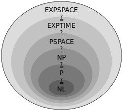
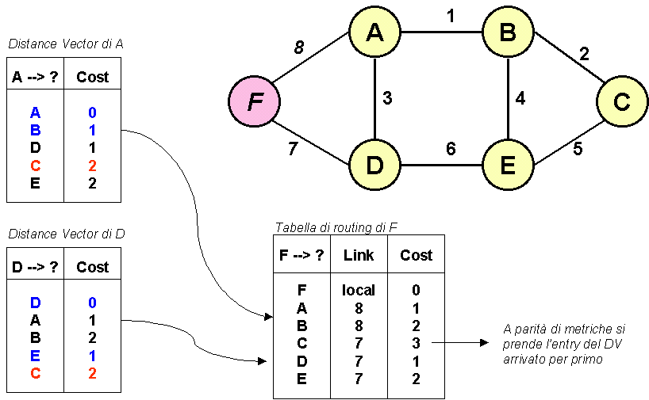

<!doctype html>
<html lang="en">

	<head>
		<meta charset="utf-8">
		<!--<link rel="SHORTCUT ICON" href="/image/logo.ico" style="width:16px; height:16px;"></link>-->
		<title>   Tesina 5^ - PNP</title>

		<meta name="description" content="A framework for easily creating beautiful presentations using HTML">
		<meta name="author" content="Hakim El Hattab">

		<meta name="apple-mobile-web-app-capable" content="yes">
		<meta name="apple-mobile-web-app-status-bar-style" content="black-translucent">

		<meta name="viewport" content="width=device-width, initial-scale=1.0, maximum-scale=1.0, user-scalable=no, minimal-ui">

		<link rel="stylesheet" href="css/reveal.css">
		<link rel="stylesheet" href="css/theme/night.css" id="theme">

		<!-- Code syntax highlighting -->
		<link rel="stylesheet" href="lib/css/zenburn.css">

		<!-- Printing and PDF exports -->
		<script>
			var link = document.createElement( 'link' );
			link.rel = 'stylesheet';
			link.type = 'text/css';
			link.href = window.location.search.match( /print-pdf/gi ) ? 'css/print/pdf.css' : 'css/print/paper.css';
			document.getElementsByTagName( 'head' )[0].appendChild( link );
		</script>

		<!--[if lt IE 9]>
		<script src="lib/js/html5shiv.js"></script>
		<![endif]-->
																								<!-- META TAG ANIMAZIONE -->
		<!-- If Chrome Frame is enabled, let's use it! -->
		<meta http-equiv="X-UA-Compatible" content="chrome=1">

		<meta name="Description" content="Show Fireworks over London entirely in JavaScript using the Canvas tag.">

		<!-- Load jQuery -->
		<script type="text/javascript" src="js-fireworks%20-%20JavaScript%20Fireworks_files/jquery.js"></script>

		<!-- Load Canvas support for IE8 and below (IE9 support Canvas) -->
		<!--[if lt IE 9]><script src="excanvas.js"></script><![endif]-->

		<!-- jQuery UI is only used for the nice slider controls -->
	<!--  <link type="text/css" href="js-fireworks%20-%20JavaScript%20Fireworks_files/ui.css" rel="stylesheet">     -->
		<script type="text/javascript" src="js-fireworks%20-%20JavaScript%20Fireworks_files/jquery-ui.js"></script>
		<script type="text/javascript" src="js-fireworks%20-%20JavaScript%20Fireworks_files/ui.js"></script>

		<!-- Load the fireworks script and stylesheet -->
		<script type="text/javascript" src="js-fireworks%20-%20JavaScript%20Fireworks_files/fireworks.js"></script>
	<!--  <link type="text/css" href="js-fireworks%20-%20JavaScript%20Fireworks_files/fireworks.css" rel="stylesheet"> -->
<!--/////////////////////////////////////////////////FINE META TAG---------------------------------------->
	<style type="text/css">
	#mappa{
			background-attachment:fixed;
			-moz-transform: scale(2);
	}
  #mappa:active{ background-attachment:fixed; transform: translateX(-15em) scale(4) translateY(0.5in); }

	</style>
	</head>

	<body> <!-- inizio del BODY -->

		<div class="reveal">
			<div class="slides">
				<section onload="alert('Scorrere con le frecce direzionali nelle direzioni consentite o spostarsi con il touch.')"> <!-- PRIMA SLIDE-->
					<h1>Classi <span style="color:#00CED1;">P</span> & <span style="color:#00CED1;">NP</span></h1>
					<h3><span style="color:#00CED1;">Millennium</span> Prize Problems </h3>
					<p><br><br><br>
						<small><span style="color:#00CED1;">visibile al sito: <a href="http://alessandrodt.altervista.org/tesina/index.html#/" target="_blank">http://alessandrodt.altervista.org/tesina/index.html#/</a><span></small><br>
						<small><span style="color:#00CED1;">Created by Alessandro Della Torre</span></small>

					</p>
					<aside class="notes">
						Bro si inizia.<br>
						Stai calmo che ce la fai.
					</aside>
				</section>
				<section data-background="image/mappa1.jpg" style="max-width: 100%;background-attachment:scroll;" data-transition="zoom" ><!-- MAPPA DEL SITO-->
					<br><br><br><br><br>
					<h2 style="color:#00CED1;" class="fragment fade-out" data-fragment-index="1">MAPPA DEGLI ARGOMENTI</h2>
					<h4 style="float:left; margin-top:-12%; margin-left:17%; " class="fragment" data-fragment-index="1">
					<a href="#/6" style="color:#00CED1;">RSA</a></h4><h6 style=" float:left; margin-top:-25%; margin-left:31%;" class="fragment" data-fragment-index="1">
						<a href="#/8">ungaret<br>ti</a></h6>
					<br><br><br><br><br>
					<h3 style="float:right; margin-top:-35%; margin-right:25%;" class="fragment" data-fragment-index="1">
					<a href="#/3/5" style="color:#00CED1;">P=NP</a></h3>
					<h4 style="float:left; margin-top:-25%; margin-left:44%;"
					class="fragment" data-fragment-index="1"><a href="#/7" style=" font-size:95%;">DISTAN-<br>CE V.</a></h4>

					<h3 style="color:#00CED1; float:left; margin-top:-11%; margin-left:78%; font-size:100%;"  class="fragment" data-fragment-index="1">
					<a href="#/3/2" style="color:#00CED1;" >Storia</a></h3>
					<h7 style="color:#00CED1; float:left; margin-top:-17%; margin-left:27%; font-size:100%;"  class="fragment" data-fragment-index="1">
					<a href="#/3/2" style="font-size:70%; color:#00CED1;" >Millenium<br>Prize<br>P</a></h7>
					</section>
					<section data-background="image/mappa2.jpg" data-transition="zoom">
						<h3 style="margin-top:20%; margin-left:-58%;">p</h3>
						<h2 style="margin-top:15%; margin-left:-62%;">np</h2>
						<h1 style="margin-top:-40%; margin-left:30%;">Risvolti<br>pratici</h1>
						<h3 style="margin-top:15%; margin-left:;">Classi di<br>complessità</h3>

					</section>

				<section>
					<h3 ><span style="color:#00CED1; font-size:140%;">I problemi</span><span style="font-size:140%;"> in informatica</span></h3><br><br>
					<pre style="width:100%;">
						<p>
 |¯¯¯¯¯¯¯¯¯¯¯¯¯¯¯¯|        |¯¯¯¯¯¯¯¯¯¯¯¯¯¯¯¯|         |¯¯¯¯¯¯¯¯¯¯¯¯¯¯¯¯|        |¯¯¯¯¯¯¯¯¯¯¯¯¯¯¯¯|
 |   PROBLEMA	  | -----> |    ALGORITMO   | ----->  |    SOLUZIONE   | -----> |    PROGRAMMA   |
 |________________|        |________________|         |________________|        |________________|
<span style="color:#00CED1;" class="fragment">         |
         |
         |
|¯¯¯¯¯¯¯¯¯¯¯¯¯¯¯¯¯¯|
|CLASSI DI PROBLEMI|
|__________________|
</span>
					</span>
					</pre>
				</section>
				<!--CLASSI COMPLESSITA , P , NP , SOLUZIONI REALI -->

				<section data-transition="convex" background-color="#fff">
					<section>
					<h2><span style="color:#00CED1;">Classi</span> di complessità</h2>
					<table>
						<tr>
							<td style="vertical-align:top;"><p >L'insieme di problemi che, se esiste la soluzione, possono essere risolti da una <span style="color:#00CED1;">macchina
						astratta</span> M usando <span style="color:#00CED1;">O(f(n))</span> della risorsa R, con n dimensione dell'
						<span style="color:#00CED1;">input</span><p></td>
					<td></td>
				</tr>
				</table>
				</section>
				<section>
					<h2>Tepo <span style="color:#00CED1;">algoritmico</span></h2>
					<p>Bisognava trovare un modo per calcolare l'efficienza di tutti gli algoritmi , questo richiedeva un <span style="color:#00CED1;">fattore comune</span> per ognuno di essi.<br>Si penso di utilizzare come metria  il tempo di esecuzione con cui l'algoritmo eseguiva il <span style="color:#00CED1;">problema.</span></p>
				</section>
			<section data-transition="convex">
					<h2><span style="color:#00CED1;">P</span> Class</h2>
					<p >Un problema è nella classe <b>P</b> se esiste un <span style="color:#00CED1;">algoritmo</span> che lo risolve utilizzando un numero di operazioni
						<span style="color:#00CED1;">polinomiale</span> nella lunghezza dell'input.</p>
					<p></p>
				</section>
				<section>
					<br><br>
					<h2>Problema da risolvere</h2>
					<p>
						<span style="color:#00CED1;">Uno dei problemi che stanno in P è trovare i divisori di un determinato INPUT.</span><br><br>
						<script>
							function divisori(){
									var stringa = document.form1.text_divisore.value;
									var numIntero =parseInt(stringa);
									var stringaFinale="";
									for(var cont=0;cont<=numIntero;cont++){
										if((numIntero%cont)==0){
											stringaFinale+=cont+" ";
										}
									}
									document.getElementById('text_print').value=stringaFinale;
							}
						</script>
						<form name="form1" class="fragment fade-out" data-fragment-index="1">
						<input type="text" value="" name="text_divisore"/>
						<input type="button" value="Calcola" onclick="divisori();" id="button_divisore"/>
						<input type="text" value=" " id="text_print" />
					</form>
					<br>
					<pre style="font-size:20px; margin-top:-5%;" class="fragment" data-fragment-index="1">
	Sorgente del programma:
						<code class="hljs" data-trim contenteditable >
	var stringa = document.form1.text_divisore.value;
	var numIntero =parseInt(stringa);
	var stringaFinale="";
	for(var cont=0;cont< numIntero;cont++){
		if((numIntero%cont)==0){
		stringaFinale+=cont+" ";
		}
	}
	document.getElementById('text_print').value=stringaFinale;
					</code>
					</pre>
					</p>
				</section>
				<section>
					<h2><span style="color:#00CED1;">NP</span> Class</h2>
					<p>Un problema è in <b>NP</b> se esiste un algoritmo che *<span style="color:#00CED1;">verifica</span>* la correttezza di una soluzione utilizzando un
						 numero di operazioni <span style="color:#00CED1;">polinomiale</span> nella lunghezza dell'input </p>
					<p></p>
			</section>
				<section data-transition="convex">
					<h2><span style="color:#00CED1;">NP</span>-Completi</h2>
					<p>E' la classe in cui stanno i problemi piu difficili di <span style="color:#00CED1;">NP</span> ,
						 se si dimostrasse che un problema <span style="color:#00CED1;">NP-C</span>(np-completo) fosse uguale ad uno NP allora
						 <span style="color:#00CED1;">tutti i problemi NP-C
					 starebbero in NP</span>.</p>
					<p></p>
				</section>
			</section>
				<section>
				<section>
					<h1><span style="color:#00CED1;"><i>P</span> = <span style="color:#00CED1;">NP</span> ?</i></h1>
				</section>
				<section>
					<h2><span style="color:#00CED1;">Millennium</span> Prize Problems </h2>
					<p style="margin-top:15%;font-size:125%;" class="fragment fade-out" data-fragment-index="1"><span style="color:#00CED1; ">Cosa sono</span>....<span style="color:#00CED1;">?</span></p>
					<p style="margin-top:-15%;" class="fragment" data-fragment-index="1"> Sono sette problemi matematici proposti
						dal<br><span style="color:#00CED1;"> Clay Mathematics Institute</span> nell'anno 2000.<br><br>
						Per ognuno che ne dimostri la soluzione riceverebbe<br> un
						premio di <span style="color:#00CED1;">1Milione</span> di dollari.<br><br>
						<span style="color:#00CED1;"><u>P = NP è uno di quelli.</u></span>
					</p>
				</section>

				<section data-transition="convex">
				<h2>Soluzioni <span style="color:#00CED1;">reali</span></h2><br>
				<p style="font-size:35px"><u><span style="color:#00CED1">Quali applicazioni potrebbe avere questa dimostrazione</span></u>?</p>
				<p></p>
			</section>
			</section>
			<section>
			<section>
				<script>
				function moltiplicazione(){
				var num=1634733645809253848443133883865090859841783670033092312104508151212118167181110842389333100511579;
				var num1=1900871281664822113126851573935413975471896789968515493802104498957191261666638539088027103465571;
				var ris=num1*num;
				document.getElementById('risultato').value=ris;
			  }
				</script>
				<h2>CRITTOGRAFIA-<span style="color:#00CED1;">RSA</span></h2>
				<p style="margin-top:15%;" class="fragment fade-out" data-fragment-index="2">Il primo impatto lo avrebbe la crittografia. <span class="fragment" data-fragment-index="1">Ma.... <span style="color:#00CED1;">perchè?</span></span></p>
				<pre style="font-size:20px; margin-top:-15%; float:left;" class="fragment" data-fragment-index="2">
      1.634.733.645.809.253.848	      1.900.871.281.664.822.113.<br>
      443.133.883.865.090.859.        126.851.573.935.413.975<br>
      841.783.670.033.092.312.   <span style="color:#00CED1;">X</span>    471.896.789.968.515.493.   <span style="color:#00CED1;">=</span>   ?<br>
      104.508.151.212.118.167.	      802.104.498.957.191.261.<br>
      181.110.842.389.333.100.        666.638.539.088.027.103.<br>
      511.579	     	              465.571<br>
				</pre>
				<p class="fragment fade-out" data-fragment-index="4">
				<span class="fragment" data-fragment-index="2">Secondo voi, quanto ci metterebbe un computer a risolvere questa moltiplicazione?</span><br>
				<span class="fragment" data-fragment-index="3" style="color:#00CED1;"><u>MENO DI UN SECONDO.</u></span>
			</p>
			<div  class="fragment" data-fragment-index="4" style="margin-top:-10%;">
				<input type="button" value="calcola" onclick="moltiplicazione();" />
				  <input type="text" value=" " id="risultato"  />
				</div>
			</section>
			<section>
				<script>
				function fattorizzazione(){
				var num=document.getElementById('testo').value;
					for(var cont=0;cont<num;cont++){
						for(var cont1=0;cont1<num;cont1++){
							if(cont*cont1==num){
								var testo= cont +'*'+ cont1;
								document.getElementById('risultato1').value=testo;
								break;
							}
						}
				}
			  }
				</script>
				<h2>Problema RSA</h2>
						<p style="color:#00CED1;">Basato sulla fattorizzazione.</p><br>
						<p style="margin-top:8%;"class="fragment fade-out" data-fragment-index="2">?&nbsp&nbspX&nbsp&nbsp?&nbsp&nbsp
							=&nbsp&nbsp81(n)</p><br>
						<p class="fragment fade-out" data-fragment-index="2"> Piu difficile da calcolare infatti bisogna eseguire tutte le
							moltiplicazioni fino ad un massimo di n (su entrambi i fattori moltiplicativi) per trovare il risultato; piu grande è ,
							 piu elevato sara il tempo per trovare i due numeri.</p>
						<p class="fragment" data-fragment-index="2" style="margin-top:-35%;">
						74037563479561712828046796097429573142593188889231289084<br>
						93623263897276503402826627689199641962511784399589433050<br>
						21275853701189680982867331732731089309005525051168770632<br>
						99072396380786710086096962537934650563796359<br><br>
					</p>
					<p class="fragment fade-out" data-fragment-index="4">
						<span class="fragment" data-fragment-index="2">Numero di 212 cifre: <span style="color:#00CED1;">RSA-704</span></span><br><br>
						<span class="fragment" data-fragment-index="3">Erano stati offerti 30.000 $ per trovare i due numeri da moltiplicare per
							ottenere quel risultato ; la gara è stata</span><br>
						<span class="fragment" data-fragment-index="3">chiusa nel 2007 e <span style="color:#00CED1;">nessuno ha vinto il premio.</span></span><br>
					</p>
					<div class="fragment" data-fragment-index="4" style="margin-top:-20% ;" >
					<input type="text" value=" " id="testo" />
					<input type="button" value="calcola" onclick="fattorizzazione();" />
					<input type="text" value=" " id="risultato1" />
				</div>
				<span class="fragment" data-fragment-index="4" style="font-size:60%;" >NB: Non oltre le 5 cifre!</span>
			</section>
			<section>
				<h2><a href="scriptrsa.html">SORGENTE RSA</a></h2>
			</section>
		</section>
		<section>
		<section>
			<h2 ><span style="color:#00CED1;">Algoritmo</span> di instradamento</h2><br>
			<ul>
				<li>Devo inviare un pacchetto dal mio computer ad un nodo della rete, mi serve un <span style="color:#00CED1;">algoritmo</span> che trovi il percorso piu
			veloce per farlo arrivare a destinazione.</li><br>
			<li>Piu è efficiente è l'algoritmo minore sarà il tempo di trasmissione dell'informazione.</li><br>
			<li>I piu utilizzati sono il <span style="color:#00CED1;">Distance Vector</span> e il <span style="color:#00CED1;">
			Link state routing</span>.</li>
		</ul>
		</section>
		<section><br><br><br>
			<h2>Distance vector</h2><br><br>
			<ul class="fragment fade-out" data-fragment-index="1">
				<li>I costi vengono assegnati in base alla distanza tra i nodi della rete</li><br>
				<li>Ogni router possiede una tabella con i costi dei router a lui adiacenti</li>
			</ul>
			<p style="margin-top:-25%" class="fragment fade-out" data-fragment-index="2"><p class="fragment " data-fragment-index="1">
				<u>Utilizza l'algoritmo di <span style="color:#00CED1">Bellman-Ford</span></u><br><br>
			Permette il calcolo dei <span style="color:#00CED1">cammini minimi</span> (ovvero il percorso migliore)
				tra i diversi nodi.</p></p>
			<p class="fragment" data-fragment-index="2">Per funzionare bisogna elaborare tutti i cammini possibili comparando i costi dei diversi percorsi al fine
				di trovare il piu efficente e attuare una <span style="color:#00CED1">comunicazione</span>.</p>
		</section>
		<section>
			
		</section>
		</section>
		<section>
		<section>
			<h3>La <span style="color:#00CED1;">complessità</span> di G.Ungaretti</h3>
			<br>
			<ul>
				<li>Autore  <span style="color:#00CED1">Ungaretti</span></li>
				<li>Opera <span style="color:#00CED1">Allegria</span></li>
				<li>Contesto storico <span style="color:#00CED1">Prima guerra mondiale</span></li>
				<li>Metrica <span style="color:#00CED1">Versi liberi</span></li>
				<li><span style="color:#00CED1">Significato della poesia</span></li>
			</ul>
		</section>
	</section>
		</section>


		<!--
				<section>
					<h2>Point of View</h2>
					<p>
						Press <strong>ESC</strong> to enter the slide overview.
					</p>
					<p>
						Hold down alt and click on any element to zoom in on it using <a href="http://lab.hakim.se/zoom-js">zoom.js</a>. Alt + click anywhere to zoom back out.
					</p>
				</section>

				<section data-markdown>
					<script type="text/template">
						## Markdown support

						Write content using inline or external Markdown.
						Instructions and more info available in the [readme](https://github.com/hakimel/reveal.js#markdown).

						```
						<section data-markdown>
						  ## Markdown support

						  Write content using inline or external Markdown.
						  Instructions and more info available in the [readme](https://github.com/hakimel/reveal.js#markdown).
						</section>
						```
					</script>
				</section>

				<section>

				</section>

				<section id="transitions">
					<h2>Transition Styles</h2>
					<p>
						You can select from different transitions, like: <br>
						<a href="?transition=none#/transitions">None</a> -
						<a href="?transition=fade#/transitions">Fade</a> -
						<a href="?transition=slide#/transitions">Slide</a> -
						<a href="?transition=convex#/transitions">Convex</a> -
						<a href="?transition=concave#/transitions">Concave</a> -
						<a href="?transition=zoom#/transitions">Zoom</a>
					</p>
				</section>

				<section>
					<section data-background="https://s3.amazonaws.com/hakim-static/reveal-js/image-placeholder.png">
						<h2>Image Backgrounds</h2>
						<pre><code class="hljs">&lt;section data-background="image.png"&gt;</code></pre>
					</section>
					<section data-background="https://s3.amazonaws.com/hakim-static/reveal-js/image-placeholder.png" data-background-repeat="repeat" data-background-size="100px">
						<h2>Tiled Backgrounds</h2>
						<pre><code class="hljs" style="word-wrap: break-word;">&lt;section data-background="image.png" data-background-repeat="repeat" data-background-size="100px"&gt;</code></pre>
					</section>
					<section data-background-video="https://s3.amazonaws.com/static.slid.es/site/homepage/v1/homepage-video-editor.mp4,https://s3.amazonaws.com/static.slid.es/site/homepage/v1/homepage-video-editor.webm" data-background-color="#000000">
						<div style="background-color: rgba(0, 0, 0, 0.9); color: #fff; padding: 20px;">
							<h2>Video Backgrounds</h2>
							<pre><code class="hljs" style="word-wrap: break-word;">&lt;section data-background-video="video.mp4,video.webm"&gt;</code></pre>
						</div>
					</section>
					<section data-background="http://i.giphy.com/90F8aUepslB84.gif">
						<h2>... and GIFs!</h2>
					</section>
				</section>

				<section>
					<h2>Pretty Code</h2>
					<pre><code class="hljs" data-trim contenteditable>

					</code></pre>
					<p>Code syntax highlighting courtesy of <a href="http://softwaremaniacs.org/soft/highlight/en/description/">highlight.js</a>.</p>
				</section>

				<section>
					<h2>Marvelous List</h2>
					<ul>
						<li>No order here</li>
						<li>Or here</li>
						<li>Or here</li>
						<li>Or here</li>
					</ul>
				</section>

				<section>
					<h2>Fantastic Ordered List</h2>
					<ol>
						<li>One is smaller than...</li>
						<li>Two is smaller than...</li>
						<li>Three!</li>
					</ol>
				</section>

				<section>
					<h2>Clever Quotes</h2>
					<p>
						These guys come in two forms, inline: <q cite="http://searchservervirtualization.techtarget.com/definition/Our-Favorite-Technology-Quotations">
						&ldquo;The nice thing about standards is that there are so many to choose from&rdquo;</q> and block:
					</p>
					<blockquote cite="http://searchservervirtualization.techtarget.com/definition/Our-Favorite-Technology-Quotations">
						&ldquo;For years there has been a theory that millions of monkeys typing at random on millions of typewriters would
						reproduce the entire works of Shakespeare. The Internet has proven this theory to be untrue.&rdquo;
					</blockquote>
				</section>

				<section>
					<h2>Intergalactic Interconnections</h2>
					<p>
						You can link between slides internally,
						<a href="#/2">like this</a>.
					</p>
				</section>

				<section>
					<h2>Speaker View</h2>
					<p>There's a <a href="https://github.com/hakimel/reveal.js#speaker-notes">speaker view</a>. It includes a timer, preview of the upcoming slide as well as your speaker notes.</p>
					<p>Press the <em>S</em> key to try it out.</p>

					<aside class="notes">
						Oh hey, these are some notes. They'll be hidden in your presentation, but you can see them if you open the speaker notes window (hit 's' on your keyboard).
					</aside>
				</section>

				<section>
					<h2>Export to PDF</h2>
					<p>Presentations can be <a href="https://github.com/hakimel/reveal.js#pdf-export">exported to PDF</a>, here's an example:</p>
					<iframe src="https://www.slideshare.net/slideshow/embed_code/42840540" width="445" height="355" frameborder="0" marginwidth="0" marginheight="0" scrolling="no" style="border:3px solid #666; margin-bottom:5px; max-width: 100%;" allowfullscreen> </iframe>
				</section>

				<section>
					<h2>Global State</h2>
					<p>
						Set <code>data-state="something"</code> on a slide and <code>"something"</code>
						will be added as a class to the document element when the slide is open. This lets you
						apply broader style changes, like switching the page background.
					</p>
				</section>

				<section data-state="customevent">
					<h2>State Events</h2>
					<p>
						Additionally custom events can be triggered on a per slide basis by binding to the <code>data-state</code> name.
					</p>
					<pre><code class="javascript" data-trim contenteditable style="font-size: 18px;">

					</code></pre>
				</section>

				<section>
					<h2>Take a Moment</h2>
					<p>
						Press B or . on your keyboard to pause the presentation. This is helpful when you're on stage and want to take distracting slides off the screen.
					</p>
				</section>

				<section>
					<h2>Much more</h2>
					<ul>
						<li>Right-to-left support</li>
						<li><a href="https://github.com/hakimel/reveal.js#api">Extensive JavaScript API</a></li>
						<li><a href="https://github.com/hakimel/reveal.js#auto-sliding">Auto-progression</a></li>
						<li><a href="https://github.com/hakimel/reveal.js#parallax-background">Parallax backgrounds</a></li>
						<li><a href="https://github.com/hakimel/reveal.js#keyboard-bindings">Custom keyboard bindings</a></li>
					</ul>
				</section>
-->
<section>
				<section>
					<pre
		style="display: block;
    font-family: monospace;
    white-space: pre;
    margin: 1em 0;">
<p style="font-size:75%; margin-left:-30%;">
          )   ___                             ______
	 (__/_____)                     /)   (, /    )      O
	   /       __   _  _  _/_  _  _(/      /---(
	  /       / (__(/_(_(_(___(/_(_(_   ) / ____) (_/_  O
	 (______)                          (_/ (     .-/
	                                            (_/
</p>
<p style="color:#00CED1; margin-left:10%;">
 ______   ___                                               __
/\  _  \ /\_ \                                             /\ \
\ \ \L\ \\//\ \      __    ____    ____     __      ___    \_\ \  _ __   ___
 \ \  __ \ \ \ \   /'__`\ /',__\  /',__\  /'__`\  /' _ `\  /'_` \/\`'__\/ __`\
  \ \ \/\ \ \_\ \_/\  __//\__, `\/\__, `\/\ \L\.\_/\ \/\ \/\ \L\ \ \ \//\ \L\ \
   \ \_\ \_\/\____\ \____\/\____/\/\____/\ \__/.\_\ \_\ \_\ \___,_\ \_\\ \____/
   \/_/\/_/\/____/\/____/\/___/  \/___/  \/__/\/_/\/_/\/_/\/__,_ /\/_/ \/___/
<br>
<br>
 _____           ___    ___                ______
/\  _  \        /\_ \  /\_ \              /\__  _\
\ \ \/\ \     __\//\ \ \//\ \      __     \/_/\ \/   ___   _ __   _ __    __
 \ \ \ \ \  /'__`\\ \ \  \ \ \   /'__`\      \ \ \  / __`\/\`'__\/\`'__\/'__`\
  \ \ \_\ \/\  __/ \_\ \_ \_\ \_/\ \L\.\_     \ \ \/\ \L\ \ \ \/ \ \ \//\  __/
   \ \____/\ \____\/\____\/\____\ \__/.\_\     \ \_\ \____/\ \_\  \ \_\\ \____\
    \/___/  \/____/\/____/\/____/\/__/\/_/      \/_/\/___/  \/_/   \/_/ \/____/
	</p>
					</pre>
				</section>
				<section>
					<h1 style="float:left; color:#00CED1;">FONTI:</h1><br>
					<ul>
						<li><a href="https://it.wikipedia.org/wiki/Pagina_principale">Wikipedia</a></li>
						<li><a href="http://www.claymath.org/">Clay mathematics institute</a></li>
						<li><a href="www.math.unipd.it/~frossi/2011.1.pnp.pdf">Dispense varie</a></li>
						<li><a href="http://news.mit.edu/2009/explainer-pnp">MIT news </a></li>
					</ul>
				</section>
			</section>
			<!--
				<section>

						      <script type="text/javascript">
						        document.write('<canvas id="cv" width="'+$(window).width()+'" height="'+($(window).height()-100)+'" style="margin-left:-50%; margn-top:-70%;"></canvas>');

						    </script><div style="background:url(../images/background.jpg) repeat-x;position:absolute;left:0;width:100%;"></div><canvas id="cv" width="1366" height="571" style="position:absolute;left:0;top:0;"></canvas>


						    <div style="display:none; background-color:black;" id="form">
						        <form onsubmit="FireworkDisplay.launchText();return false;">
						            <div>
						                              <input id="firetext" value="THE END" type="text"style="display:none;" >
						            </div>
						        </form>
						    </div>

						    <script type="text/javascript">
						        // analytics tag to report visitors.  We also report every message launched.
						        var gaJsHost = (("https:" == document.location.protocol) ? "https://ssl." : "http://www.");
						        document.write(unescape("%3Cscript src='" + gaJsHost + "google-analytics.com/ga.js' type='text/javascript'%3E%3C/script%3E"));
						    </script><script src="js-fireworks%20-%20JavaScript%20Fireworks_files/ga.js" type="text/javascript"></script>
						    <script type="text/javascript">
						        try {
						        var pageTracker = _gat._getTracker("UA-6696309-2");
						        pageTracker._trackPageview();
						        } catch(err) {}
						    </script>


				</section>
			-->
			</div>

		</div>

		<script src="lib/js/head.min.js"></script>
		<script src="js/reveal.js"></script>

		<script>

			// Full list of configuration options available at:
			// https://github.com/hakimel/reveal.js#configuration
			Reveal.initialize({
				controls: true,
				progress: true,
				history: true,
				center: true,

				transition: 'slide', // none/fade/slide/convex/concave/zoom

				// Optional reveal.js plugins
				dependencies: [
					{ src: 'lib/js/classList.js', condition: function() { return !document.body.classList; } },
					{ src: 'plugin/markdown/marked.js', condition: function() { return !!document.querySelector( '[data-markdown]' ); } },
					{ src: 'plugin/markdown/markdown.js', condition: function() { return !!document.querySelector( '[data-markdown]' ); } },
					{ src: 'plugin/highlight/highlight.js', async: true, callback: function() { hljs.initHighlightingOnLoad(); } },
					{ src: 'plugin/zoom-js/zoom.js', async: true },
					{ src: 'plugin/notes/notes.js', async: true }
				]
			});

		</script>

	</body>
</html>
